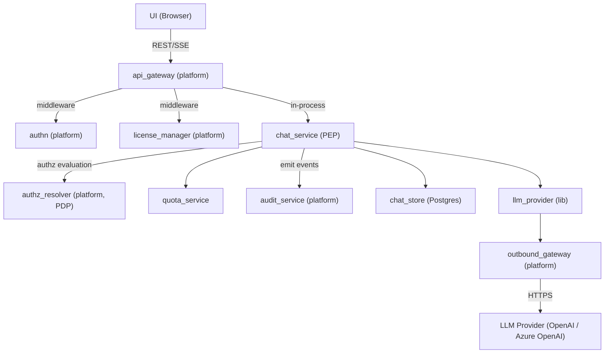
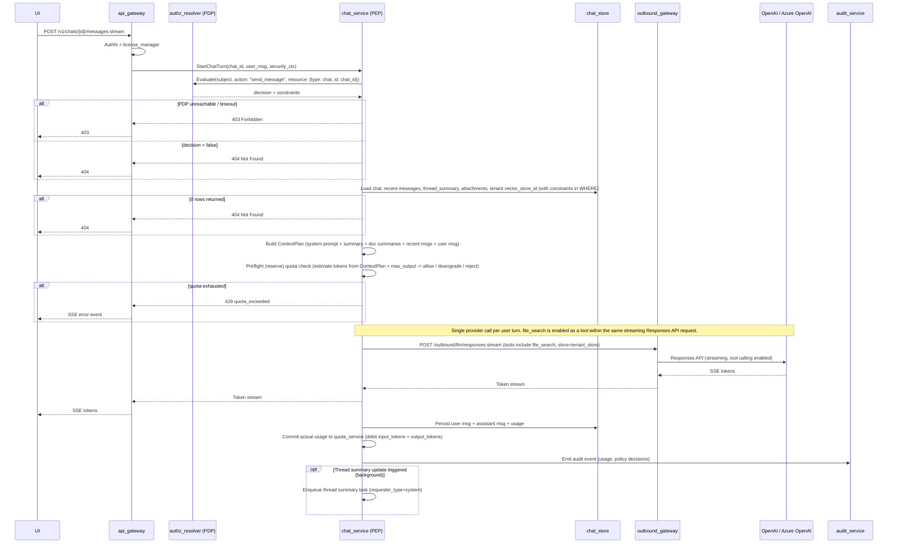
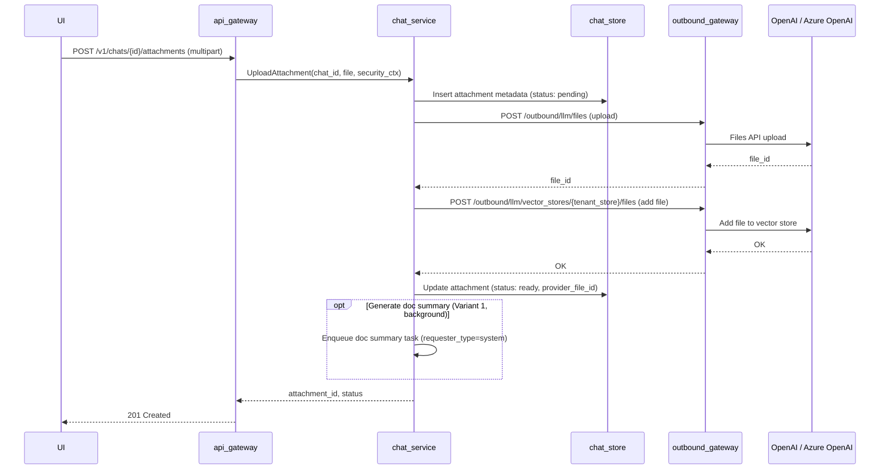
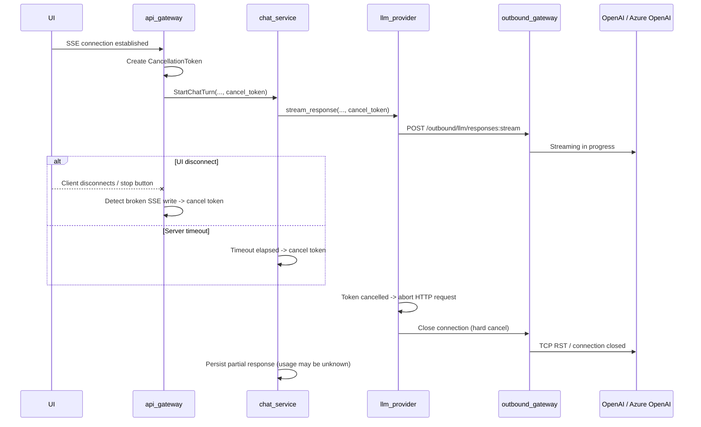
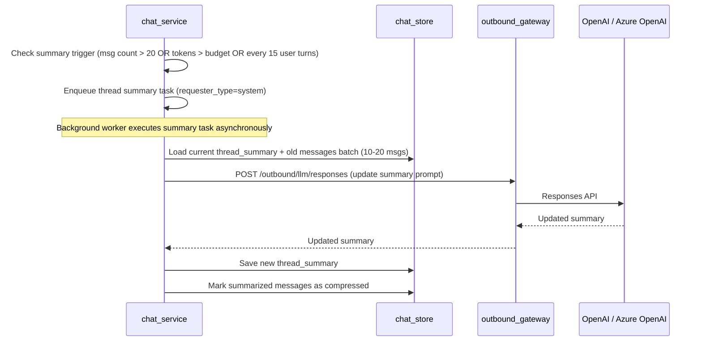

# Technical Design: Mini Chat

## 1. Architecture Overview

### 1.1 Architectural Vision

Mini Chat provides a multi-tenant AI chat experience with SSE streaming, conversation history, and document-aware question answering. Users interact through a REST/SSE API backed by the Responses API with File Search (OpenAI or Azure OpenAI - see [Provider API Mapping](#provider-api-mapping)). The system maintains strict tenant isolation via per-tenant vector stores and enforces cost control through token budgets, usage quotas, and file search limits. Authorization decisions are delegated to the platform's AuthZ Resolver (PDP), which returns query-level constraints compiled to SQL by `chat_service` acting as the Policy Enforcement Point (PEP).

The architecture is modular: `chat_service` orchestrates all request processing - context assembly, LLM invocation, streaming relay, and persistence. It owns the full request lifecycle from receiving a user message to persisting the assistant response and usage metrics. External LLM calls route exclusively through the platform's Outbound API Gateway (OAGW), which handles credential injection and egress control. Mini Chat calls the LLM provider directly via OAGW rather than through `cf-llm-gateway`, because it relies on provider-specific features (Responses API, Files API, File Search with vector stores) that the generic gateway does not abstract. Both OpenAI and Azure OpenAI expose a compatible Responses API surface; OAGW routes to the configured provider and injects the appropriate credentials (API key header for OpenAI, `api-key` header or Entra ID bearer token for Azure OpenAI).

Long conversations are managed via thread summaries - a Level 1 compression strategy where older messages are periodically summarized by the LLM, and the summary replaces them in the context window. This keeps token costs bounded while preserving key facts, decisions, and document references.

### 1.2 Architecture Drivers

#### Functional Drivers

| Requirement | Design Response |
|-------------|-----------------|
| `cpt-cf-mini-chat-fr-chat-streaming` | SSE streaming via `chat_service` -> OAGW -> Responses API (OpenAI: `POST /v1/responses`; Azure OpenAI: `POST /openai/v1/responses`) |
| `cpt-cf-mini-chat-fr-conversation-history` | `chat_store` (Postgres) persists all messages; recent messages loaded per request |
| `cpt-cf-mini-chat-fr-file-upload` | Upload via OAGW -> Files API (OpenAI: `POST /v1/files`; Azure OpenAI: `POST /openai/files`); metadata in `chat_store`; file added to tenant vector store. P0 uses `purpose="assistants"` for both providers (OpenAI also supports `purpose="user_data"`, but we use `assistants` to keep parity and because the files are used with Vector Stores / File Search). |
| `cpt-cf-mini-chat-fr-file-search` | File Search tool call scoped to tenant vector store (identical `file_search` tool on both OpenAI and Azure OpenAI Responses API) |
| `cpt-cf-mini-chat-fr-doc-summary` | See **File Upload** sequence ("Generate doc summary" background variant) and `attachments.doc_summary` schema field |
| `cpt-cf-mini-chat-fr-thread-summary` | Periodic LLM-driven summarization of old messages; summary replaces history in context |
| `cpt-cf-mini-chat-fr-chat-crud` | REST endpoints for create/list/get/delete chats |
| `cpt-cf-mini-chat-fr-temporary-chat` | Toggle temporary flag; scheduled cleanup after 24h |
| `cpt-cf-mini-chat-fr-chat-deletion-cleanup` | See **Cleanup on Chat Deletion** |
| `cpt-cf-mini-chat-fr-streaming-cancellation` | See **Streaming Cancellation** sequence and quota bounded best-effort debit rules in `quota_service` |
| `cpt-cf-mini-chat-fr-quota-enforcement` | See `quota_service` component and `quota_usage` table |
| `cpt-cf-mini-chat-fr-token-budget` | See constraint **Context Window Budget** and ContextPlan truncation rules |
| `cpt-cf-mini-chat-fr-license-gate` | See constraint **License Gate** and dependency `license_manager (platform)` |
| `cpt-cf-mini-chat-fr-audit` | Emit audit events to platform `audit_service` for every AI interaction |
| `cpt-cf-mini-chat-fr-ux-recovery` | See **Streaming Contract** (Idempotency + reconnect rule) and **Turn Status API** |
| `cpt-cf-mini-chat-fr-group-chats` | Deferred to P2+ — see `cpt-cf-mini-chat-adr-group-chat-usage-attribution` |

#### NFR Allocation

| NFR ID | NFR Summary | Allocated To | Design Response | Verification Approach |
|--------|-------------|--------------|-----------------|----------------------|
| `cpt-cf-mini-chat-nfr-tenant-isolation` | Tenant data must never leak across tenants | `chat_service`, `chat_store` | Per-tenant vector store; all queries scoped by `tenant_id`; no user-supplied `file_id` or `vector_store_id` in API | Integration tests with multi-tenant scenarios |
| `cpt-cf-mini-chat-nfr-authz-alignment` | Authorization must follow platform PDP/PEP model | `chat_service` (PEP) | AuthZ Resolver evaluates every data-access operation; constraints compiled to SQL WHERE clauses; fail-closed on PDP errors | Integration tests with mock PDP; fail-closed verification tests |
| `cpt-cf-mini-chat-nfr-cost-control` | Predictable and bounded LLM costs | `quota_service`, `chat_service` | Per-user daily/monthly limits; auto-downgrade to base model; file search call limits; token budget per request | Usage metrics dashboard; budget alert tests |
| `cpt-cf-mini-chat-nfr-streaming-latency` | Low time-to-first-token for chat responses | `chat_service`, OAGW | Direct SSE relay without buffering; cancellation propagation on disconnect | TTFT benchmarks under load; **Disconnect test**: open SSE -> receive 1-2 tokens -> disconnect -> assert provider request closed within 200 ms and active-generation counter decrements; **TTFT delta test**: measure `t_first_token_ui - t_first_byte_from_provider` -> assert platform overhead < 50 ms p99 |
| `cpt-cf-mini-chat-nfr-data-retention` | Temporary chats cleaned up; deleted chats purged from provider | `chat_store`, `chat_service` | Scheduled cleanup job; cascade delete to provider files and vector store entries (OpenAI Files API / Azure OpenAI Files API) | Retention policy compliance tests |
| `cpt-cf-mini-chat-nfr-observability-supportability` | Operational visibility for on-call, SRE, and cost governance | `chat_service`, `quota_service` | `mini_chat_*` Prometheus metrics on all critical paths; stable `request_id` tracing per turn; structured audit events; turn state API (`GET /turns/{request_id}`) | Metric series presence tests; request_id propagation tests; alert rule validation |

### 1.3 Architecture Layers

```text
┌───────────────────────────────────────────────────────┐
│  Presentation (api_gateway - platform)                │
│  REST + SSE endpoints, AuthN middleware               │
├───────────────────────────────────────────────────────┤
│  Application (chat_service - PEP)                     │
│  Orchestration, authz evaluation, context planning,   │
│  streaming                                            │
│  ┌───────────┐  ┌─────────────────────┐               │
│  │ quota_svc │  │ authz_resolver (PDP)│               │
│  └───────────┘  └─────────────────────┘               │
├───────────────────────────────────────────────────────┤
│  Domain                                               │
│  Chat, Message, Attachment, ThreadSummary,            │
│  ContextPlan, QuotaPolicy                             │
├───────────────────────────────────────────────────────┤
│  Infrastructure                                       │
│  ┌─────────────┐  ┌───────────────────────────┐       │
│  │ chat_store  │  │ llm_provider (lib)        │       │
│  │ (Postgres)  │  │ -> OAGW -> OpenAI /       │       │
│  │             │  │          Azure OpenAI     │       │
│  └─────────────┘  └───────────────────────────┘       │
└───────────────────────────────────────────────────────┘
```

| Layer | Responsibility | Technology |
|-------|---------------|------------|
| Presentation | Public REST/SSE API, authentication, routing | Axum (platform api_gateway) |
| Application | Request orchestration, authorization evaluation (PEP), context assembly, streaming relay, quota checks | Rust (chat_service crate) |
| Domain | Business entities and rules | Rust structs |
| Infrastructure | Persistence, external LLM communication | Postgres (sqlx), HTTP client (reqwest) via OAGW |

## 2. Principles & Constraints

### 2.1 Design Principles

#### Tenant-Scoped Everything

**ID**: `cpt-cf-mini-chat-principle-tenant-scoped`

Every data access is scoped by constraints issued by the AuthZ Resolver (PDP). At P0, chat content is owner-only: the PDP returns `eq` predicates on `owner_tenant_id` and `user_id` that `chat_service` (PEP) compiles to SQL WHERE clauses. This replaces application-level tenant/user scoping with a formalized constraint model aligned with the platform's [Authorization Design](../../../docs/arch/authorization/DESIGN.md). Vector stores, file uploads, and quota checks all require tenant context. No API accepts raw `vector_store_id` or `file_id` from the client.

#### Owner-Only Chat Content

**ID**: `cpt-cf-mini-chat-principle-owner-only-content`

Chat content (messages, attachments, summaries, citations) is accessible only to the owning user within their tenant. Parent tenants / MSP administrators MUST NOT have access to chat content. Admin visibility is limited to aggregated usage and operational metrics.

#### Summary Over History

**ID**: `cpt-cf-mini-chat-principle-summary-over-history`

The system favors compressed summaries over unbounded message history. Old messages are summarized rather than paginated into the LLM context. This bounds token costs and keeps response quality stable for long conversations.

#### Streaming-First

**ID**: `cpt-cf-mini-chat-principle-streaming-first`

All LLM responses are streamed. The primary delivery path is SSE from LLM provider (OpenAI / Azure OpenAI) -> OAGW -> chat_service -> api_gateway -> UI. Non-streaming responses are not supported for chat completion. Both providers use an identical SSE event format for the Responses API.

### 2.2 Constraints

#### OpenAI-Compatible Provider (P0)

**ID**: `cpt-cf-mini-chat-constraint-openai-compatible`

P0 targets the OpenAI-compatible API surface - either **OpenAI** or **Azure OpenAI** as the LLM provider. Both expose the Responses API, Files API, Vector Stores API, and File Search tool with compatible request/response contracts. The active provider is selected per deployment via OAGW configuration; `llm_provider` does not need a runtime abstraction layer because the API surface is shared. Multi-provider support (e.g., Anthropic, Google) is deferred.

**Provider parity notes** (Azure OpenAI known limitations at time of writing):
- Azure supports only **one vector store** per `file_search` tool call (sufficient for P0: one vector store per tenant).
- `purpose="user_data"` for file uploads is not supported on Azure; use `purpose="assistants"`.
- `vector_stores.search` (client-side manual search) is not exposed on Azure - not used in this design.
- New OpenAI features may appear on Azure with a lag of weeks to months.

**OpenAI file upload purpose choice (P0)**: although OpenAI supports both `purpose="user_data"` and `purpose="assistants"`, Mini Chat uses `purpose="assistants"` to align with Azure OpenAI and to keep the upload path uniform across providers.

#### No Credential Storage

**ID**: `cpt-cf-mini-chat-constraint-no-credentials`

Mini Chat never stores or handles API keys. All external calls go through OAGW, which injects credentials from CredStore.

#### Context Window Budget

**ID**: `cpt-cf-mini-chat-constraint-context-budget`

Every request must fit within fixed `max_input_tokens` and `max_output_tokens` budgets. When context exceeds the budget, the system truncates in order: old messages (not summary), doc summaries, retrieval excerpts. A reserve is always maintained for the response.

#### License Gate

**ID**: `cpt-cf-mini-chat-constraint-license-gate`

Access requires the `ai_chat` feature on the tenant license, enforced by the platform's `license_manager` middleware. Requests from unlicensed tenants receive HTTP 403.

#### No Buffering

**ID**: `cpt-cf-mini-chat-constraint-no-buffering`

No layer in the streaming pipeline may collect the full LLM response before relaying it. Every component - `llm_provider`, `chat_service`, `api_gateway` - must read one SSE event and immediately forward it to the next layer. Middleware must not buffer response bodies. `.collect()` on the token stream is prohibited in the hot path.

#### Bounded Channels

**ID**: `cpt-cf-mini-chat-constraint-bounded-channels`

Internal mpsc channels between `llm_provider` -> `chat_service` -> SSE writer must use bounded buffers (16–64 messages). This provides backpressure: if the consumer is slow, the producer blocks rather than accumulating unbounded memory. Channel capacity is configurable per deployment.

#### Quota Before Outbound

**ID**: `cpt-cf-mini-chat-constraint-quota-before-outbound`

All product-level quota decisions (block, downgrade, limit) MUST be made in `chat_service` before any request reaches OAGW. OAGW never makes user-level or tenant-level quota decisions - it is transport + credential broker only. Only `chat_service` has the business context needed for quota decisions: tenant, user, license tier, premium/standard status, downgrade rules, file_search call limits. OAGW sees an opaque HTTP request with no business semantics.

Model selection and lifecycle rules (P0) are configuration-owned and applied at the `chat_service` boundary:

- Model defaults, upgrade policy, and downgrade thresholds MUST be defined in deployment configuration (P0) and are expected to be owned by a platform Settings Service / License Manager layer as the long-term system of record.
- `chat_service` / `quota_service` is the enforcement point: it MUST deterministically choose the effective model before the outbound call (allow / downgrade / reject) and MUST surface the chosen model via metrics (`{model}` label) and audit.

Global emergency flags / kill switches (P0): operators MUST have a way to immediately reduce cost and risk at runtime via configuration-owned flags.

- `disable_premium_models` - if enabled, premium models MUST NOT be used; requests that would have used premium MUST be downgraded to base.
- `force_base_model` - if enabled, all requests MUST use the base model regardless of quota tier.
- `disable_file_search` - if enabled, `file_search` tool calls MUST be skipped; responses proceed without retrieval.

Ownership: these flags are owned and operated by platform configuration (P0: deployment config). Long-term, they are expected to be owned by Settings Service / License Manager with privileged operator access.

Hard caps: token budgets (`max_input_tokens`, `max_output_tokens`) MUST remain configurable and can serve as an emergency hard cap lever.

## 3. Technical Architecture

### 3.1 Domain Model

**Technology**: Rust structs

**Core Entities**:

| Entity | Description |
|--------|-------------|
| Chat | A conversation belonging to a user within a tenant. Has title, temporary flag, creation/update timestamps. |
| Message | A single turn in a chat (role: user/assistant/system). Stores content, token estimate, compression status. |
| Attachment | File uploaded to a chat. References provider `file_id` (OpenAI or Azure OpenAI), linked to tenant vector store. Has processing status. |
| ThreadSummary | Compressed representation of older messages in a chat. Replaces old history in the context window. |
| TenantVectorStore | Mapping from `tenant_id` to provider `vector_store_id` (OpenAI or Azure OpenAI Vector Stores API). One vector store per tenant. |
| AuditEvent | Structured event emitted to platform `audit_service`: prompt, response, user/tenant, timestamps, policy decisions, usage. Not stored locally. |
| QuotaUsage | Per-user usage counters for rate limiting and budget enforcement. Tracks daily/monthly periods. |
| ContextPlan | Transient object assembled per request: system prompt, summary, doc summaries, recent messages, user message, retrieval excerpts. |

**Relationships**:
- Chat -> Message: 1..\*
- Chat -> Attachment: 0..\*
- Chat -> ThreadSummary: 0..1
- Attachment -> TenantVectorStore: belongs to (via tenant_id)
- Message -> AuditEvent: 1..1 (each turn emits an audit event to platform `audit_service`)

### 3.2 Component Model



**Components**:

**ID**: `cpt-cf-mini-chat-component-chat-service`

- **chat_service** - Core orchestrator and Policy Enforcement Point (PEP). Receives user messages, evaluates authorization via AuthZ Resolver, builds context plan, invokes LLM via `llm_provider`, relays streaming tokens, persists messages and usage, triggers thread summary updates.

**ID**: `cpt-cf-mini-chat-component-chat-store`

- **chat_store** - Postgres persistence layer. Source of truth for chats, messages, attachments, thread summaries, tenant vector store mappings, and quota usage.

**ID**: `cpt-cf-mini-chat-component-llm-provider`

- **llm_provider** - Library (not a standalone service) used by `chat_service`. Builds requests for the Responses API (OpenAI or Azure OpenAI - both expose a compatible surface), parses SSE streams, maps errors. Propagates tenant/user metadata via `user` and `metadata` fields on every request (see section 4: Provider Request Metadata). Handles both streaming chat and non-streaming calls (summary generation, doc summary). The library is provider-agnostic at the API contract level; OAGW handles endpoint routing and credential injection per configured provider.

**ID**: `cpt-cf-mini-chat-component-quota-service`

- **quota_service** - Enforces per-user usage limits by period (daily, monthly). Supports auto-downgrade to base model when premium quota is exhausted. Tracks file search call counts separately. Uses **two-phase quota counting**:
  - **Phase 1 - Preflight (reserve) estimate** (on stream start, before outbound call): estimate token cost from `ContextPlan` size + `max_output_tokens` and reserve it for quota enforcement. Decision: allow at current model / downgrade model / reject with `quota_exceeded`.
    - Reserve MUST prevent parallel requests from overspending remaining quota.
    - Reserve SHOULD be keyed by `(tenant_id, user_id, period_type, period_start)` and reconciled on terminal outcome.
  - **Phase 2 - Commit actual** (on `event: done`): reconcile the reserve to actual usage (`response.usage.input_tokens` + `response.usage.output_tokens`) and commit actual to `quota_usage`. If actual exceeds estimate (overshoot), the completed response is never retroactively cancelled, but guardrails apply:
    - Commit MUST be atomic per `(tenant_id, user_id, period_type, period_start)` (avoid race conditions under parallel streams)
    - If the remaining quota is below a configured negative threshold, preflight MUST reject new requests with `quota_exceeded`
    - `max_output_tokens` and an explicit input budget MUST bound the maximum cost per request
  - **Streaming constraint**: quota check is preflight-only. Mid-stream abort due to quota is NOT supported (would produce broken UX and partial content). Mid-stream abort is only triggered by: user cancel, provider error, or infrastructure limits.

Cancel/disconnect rule: if a stream ends without a terminal `done`/`error` event, `quota_service` MUST commit a bounded best-effort debit (default: the reserved estimate) so cancellations cannot evade quotas.

Reserve is an internal accounting concept (it may be implemented as held/pending fields or a row-level marker), but the observable external semantics MUST match the rules above.

Background tasks (thread summary update, document summary generation) MUST run with `requester_type=system` and MUST NOT be charged to an arbitrary end user. Usage for these tasks is charged to a tenant operational bucket (implementation-defined) and still emitted to `audit_service`.

**ID**: `cpt-cf-mini-chat-component-authz-integration`

- **authz_resolver (PDP)** - Platform AuthZ Resolver module. `chat_service` calls it before every data-access operation to obtain authorization decisions and SQL-compilable constraints. See section 3.8.


### 3.3 API Contracts

**ID**: `cpt-cf-mini-chat-interface-rest-api`

**Technology**: REST/OpenAPI, SSE

**Endpoints Overview**:

| Method | Path | Description | Stability |
|--------|------|-------------|-----------|
| `POST` | `/v1/chats` | Create a new chat | stable |
| `GET` | `/v1/chats` | List chats for current user | stable |
| `GET` | `/v1/chats/{id}` | Get chat metadata + recent messages | stable |
| `DELETE` | `/v1/chats/{id}` | Delete chat (with retention cleanup) | stable |
| `POST` | `/v1/chats/{id}:temporary` | Toggle temporary flag (24h TTL) | stable |
| `POST` | `/v1/chats/{id}/messages:stream` | Send message, receive SSE stream | stable |
| `POST` | `/v1/chats/{id}/attachments` | Upload file attachment | stable |
| `GET` | `/v1/chats/{id}/turns/{request_id}` | Get authoritative turn status (read-only) | stable |

**Streaming Contract** (`POST /v1/chats/{id}/messages:stream`) — **ID**: `cpt-cf-mini-chat-contract-sse-streaming`:

The SSE protocol below is the **stable public contract** between `chat_service` and UI clients. Provider-specific streaming events (OpenAI/Azure OpenAI Responses API) are translated internally by `llm_provider` / `chat_service` and are never exposed to clients. See [Provider Event Translation](#provider-event-translation).

Request body:
```json
{
  "content": "string",
  "request_id": "uuid (client-generated, optional)"
}
```

**Idempotency**: The idempotency key is `(chat_id, request_id)`. Behavior when `request_id` is provided:

| State | Server behavior |
|-------|----------------|
| Active generation exists for key | Return `409 Conflict`. (P2+: attach to existing stream.) |
| Completed generation exists for key | Return a fast replay SSE stream without triggering a new provider request: one `delta` event containing the full persisted assistant text, then `citations` if available, then `done`. |
| No record for key | Start a new generation normally. |

If `request_id` is omitted, the server treats the request as non-idempotent (no replay semantics).

The UI MUST generate a new `request_id` per user send action. The UI MUST NOT auto-retry with the same `request_id` unless it intends to resume/retrieve the same generation.

 Active generation detection and completed replay are based on a durable `chat_turns` record (see section 3.7). `messages.request_id` uniqueness alone is not sufficient to represent `running` state.

 Reconnect rule (P0): if the SSE stream disconnects before a terminal `done`/`error`, the UI MUST NOT automatically retry `POST /messages:stream` with the same `request_id` (it will most likely hit `409 Conflict`). The UI should treat the send as indeterminate and require explicit user action (resend with a new `request_id`).

 **P2+ note**: add a read API for turn state (planned), for example `GET /v1/chats/{id}/turns/{request_id}`, allowing the UI to distinguish "double send" vs "network reconnect" and enabling clean resume behavior.

**P0 optional, recommended**: expose a read API for turn state backed by `chat_turns` (for example `GET /v1/chats/{id}/turns/{request_id}`) so support and UI recovery flows can query authoritative turn state rather than inferring it from client retry outcomes.

#### Turn Status API (P0 optional, recommended) — **ID**: `cpt-cf-mini-chat-interface-turn-status`

To support reconnect UX and reduce support reliance on direct DB inspection, the service SHOULD expose a read-only turn status endpoint backed by `chat_turns`.

**Endpoint**: `GET /v1/chats/{id}/turns/{request_id}`

**Response**:

- `chat_id`
- `request_id`
- `state`: `running|done|error|cancelled`
- `updated_at`

**SSE mapping**:

- API `done` corresponds to internal `chat_turns.state = completed` and terminal `event: done`
- API `error` corresponds to internal `chat_turns.state = failed` and terminal `event: error`
- API `cancelled` corresponds to internal `chat_turns.state = cancelled` and indicates cancellation was processed; the UI should treat it as terminal and allow resend with a new `request_id`

 UI guidance: if the SSE stream disconnects before a terminal event, the UI SHOULD show a user-visible banner: "Message delivery uncertain due to connection loss. You can resend." Resend MUST use a new `request_id`.

#### SSE Event Definitions

Six event types. The stream always ends with exactly one terminal event: `done` or `error`.

##### `event: delta`

Streams incremental assistant output.

```
event: delta
data: {"type": "text", "content": "partial text"}

event: delta
data: {"type": "text", "content": " more text"}
```

| Field | Type | Description |
|-------|------|-------------|
| `type` | string | Output type. P0: always `"text"`. Reserved for future types (e.g., `"markdown"`, `"structured"`). |
| `content` | string | Incremental text fragment. |

##### `event: tool`

Reports tool activity (file_search at P0, web_search at P1+).

```
event: tool
data: {"phase": "start", "name": "file_search", "details": {}}

event: tool
data: {"phase": "done", "name": "file_search", "details": {"files_searched": 3}}
```

| Field | Type | Description |
|-------|------|-------------|
| `phase` | `"start"` \| `"progress"` \| `"done"` | Lifecycle phase of the tool call. |
| `name` | string | Tool identifier. P0: `"file_search"`. |
| `details` | object | Tool-specific metadata. MUST be non-sensitive and tenant-safe. Content is minimal and stable at P0. |

##### `event: citations`

Delivers source references used in the answer.

```
event: citations
data: {"items": [{"source": "file", "title": "Q3 Report.pdf", "attachment_id": "uuid", "file_id": "file-abc123", "snippet": "Revenue grew 15%...", "score": 0.92}]}
```

| Field | Type | Description |
|-------|------|-------------|
| `items[].source` | `"file"` \| `"web"` | Citation source type. |
| `items[].title` | string | Document or page title. |
| `items[].url` | string (optional) | URL for web sources. |
| `items[].attachment_id` | UUID (optional) | Internal attachment identifier for file sources. Preferred identifier for UI references. |
| `items[].file_id` | string (optional) | Provider file ID for file sources. |
| `items[].span` | object (optional) | Reserved for mapping citations to the final assistant text. If provided: `{ "start": number, "end": number }` character offsets into the full assistant output. |
| `items[].snippet` | string | Relevant excerpt. |
| `items[].score` | number (optional) | Relevance score (0-1). |

`items[].file_id` is provider-issued and MUST be treated as opaque display-only metadata. Clients MUST NOT send it back to any API.

P0: `citations` is sent once near stream completion, before `done`. The contract supports multiple `citations` events per stream for future use.

##### `event: done`

Finalizes the stream. Provides usage and provider correlation metadata.

```
event: done
data: {"message_id": "uuid", "usage": {"input_tokens": 500, "output_tokens": 120, "model": "gpt-5.2"}, "provider": {"name": "openai", "response_id": "resp_abc123"}}
```

| Field | Type | Description |
|-------|------|-------------|
| `message_id` | UUID | Persisted assistant message ID. |
| `usage.input_tokens` | number | Actual input tokens consumed. |
| `usage.output_tokens` | number | Actual output tokens consumed. |
| `usage.model` | string | Model used for generation. |
| `provider.name` | `"openai"` \| `"azure_openai"` | Active provider. |
| `provider.response_id` | string | Provider-side response ID for debugging and OAGW log correlation. |

##### `event: error`

Terminates the stream with an application error. No further events follow.

```
event: error
data: {"code": "quota_exceeded", "message": "Daily limit reached"}
```

| Field | Type | Description |
|-------|------|-------------|
| `code` | string | Canonical error code (see table below). |
| `message` | string | Human-readable description. |

##### `event: ping`

Keepalive to prevent idle-timeout disconnects by proxies and browsers (especially when the model is "thinking" before producing tokens). Sent every 15-30 seconds during generation. Clients MUST ignore `ping` events.

```
event: ping
data: {}
```

#### SSE Event Ordering

A well-formed stream follows this ordering:

```text
ping*  (delta | tool | citations)*  (done | error)
```

- Zero or more `ping` events may appear at any point.
- `delta`, `tool`, and `citations` events may interleave in any order.
- Exactly one terminal event (`done` or `error`) ends the stream.

<a id="provider-event-translation"></a>
#### Provider Event Translation

Provider-specific streaming events are internal to `llm_provider` and `chat_service`. They are never forwarded to clients. The translation layer maps provider events to the stable SSE protocol defined above.

| Provider Event | Stable SSE Event | Notes |
|----------------|-----------------|-------|
| `response.output_text.delta` | `event: delta` (`type: "text"`) | Text content mapped 1:1. |
| `response.file_search_call.searching` | `event: tool` (`phase: "start"`, `name: "file_search"`) | Emitted when file_search tool is invoked. |
| `response.file_search_call.completed` | `event: tool` (`phase: "done"`, `name: "file_search"`) | `details` populated from search results metadata. |
| File search annotations in response | `event: citations` | Extracted from provider annotations, mapped to `items[]` schema. When provider annotations include ranges, `items[].span` SHOULD be populated as character offsets into the final assistant text. |
| `response.completed` | `event: done` | `usage` from `response.usage`; `provider.response_id` from `response.id`. |
| Provider HTTP error / disconnect | `event: error` (`code: "provider_error"` or `"provider_timeout"`) | Error details sanitized; provider internals not exposed. |
| Provider 429 | `event: error` (`code: "rate_limited"`) | After OAGW retry exhaustion. |

This mapping is intentionally provider-agnostic in the stable contract. If the provider changes its event format or a new provider is added, only the translation layer in `llm_provider` is updated. The client contract remains unchanged.

**Error Codes**:

| Code | HTTP Status | Description |
|------|-------------|-------------|
| `feature_not_licensed` | 403 | Tenant lacks `ai_chat` feature |
| `insufficient_permissions` | 403 | Subject lacks permission for the requested action (AuthZ Resolver denied) |
| `chat_not_found` | 404 | Chat does not exist or not accessible under current authorization constraints |
| `quota_exceeded` | 429 | User exceeded daily/monthly usage limit |
| `rate_limited` | 429 | Too many requests in time window |
| `file_too_large` | 413 | Uploaded file exceeds size limit |
| `unsupported_file_type` | 415 | File type not supported for upload |
| `provider_error` | 502 | LLM provider returned an error |
| `provider_timeout` | 504 | LLM provider request timed out |

### 3.4 Internal Dependencies

| Dependency Module | Interface Used | Purpose |
|-------------------|----------------|---------|
| api_gateway (platform) | Axum router / middleware | HTTP request handling, SSE transport |
| authn (platform) | Middleware (JWT/opaque token) | Extract `user_id` + `tenant_id` from request |
| license_manager (platform) | Middleware | Check tenant has `ai_chat` feature; reject with 403 if not |
| authz_resolver (platform) | Access evaluation API (`/access/v1/evaluation`) | Obtain authorization decisions + SQL-compilable constraints for chat operations |
| audit_service (platform) | Event emitter | Receive structured audit events (prompts, responses, usage, policy decisions) |
| outbound_gateway (platform) | Internal HTTP | Egress to LLM provider (OpenAI / Azure OpenAI) with credential injection |

**Dependency Rules**:
- `chat_service` never calls the LLM provider (OpenAI / Azure OpenAI) directly; all external calls go through OAGW
- `SecurityContext` (user_id, tenant_id) propagated through all in-process calls
- `license_manager` runs as middleware before `chat_service` is invoked
- `chat_service` calls `authz_resolver` before every database query; on PDP denial or PDP unreachable, fail-closed (deny access)
- `chat_service` emits audit events to `audit_service` after each turn; mini-chat does not store audit data locally

### 3.5 External Dependencies

#### LLM Provider (OpenAI / Azure OpenAI)

Both providers expose a compatible API surface. OAGW routes requests to the configured provider and injects credentials accordingly.

| API | Purpose | OAGW Route | OpenAI Endpoint | Azure OpenAI Endpoint |
|-----|---------|------------|-----------------|----------------------|
| Responses API (streaming) | Chat completion with tool support | `POST /outbound/llm/responses:stream` | `POST https://api.openai.com/v1/responses` | `POST https://{resource}.openai.azure.com/openai/v1/responses` |
| Responses API (non-streaming) | Thread summary generation, doc summary | `POST /outbound/llm/responses` | `POST https://api.openai.com/v1/responses` | `POST https://{resource}.openai.azure.com/openai/v1/responses` |
| Files API | Upload user documents | `POST /outbound/llm/files` | `POST https://api.openai.com/v1/files` | `POST https://{resource}.openai.azure.com/openai/files` |
| Vector Stores API | Manage per-tenant vector stores, add/remove files | `POST /outbound/llm/vector_stores/*` | `POST https://api.openai.com/v1/vector_stores/*` | `POST https://{resource}.openai.azure.com/openai/v1/vector_stores/*` |
| File Search (tool) | Retrieve document excerpts during chat | - (invoked as tool within Responses API call) | `file_search` tool | `file_search` tool (identical contract) |

Note: Azure OpenAI path variants differ by rollout; OAGW owns the exact path mapping for each API.

<a id="provider-api-mapping"></a>
**Provider API Mapping** - authentication and endpoint differences:

| Aspect | OpenAI | Azure OpenAI |
|--------|--------|--------------|
| **Base URL** | `https://api.openai.com/v1` | `https://{resource}.openai.azure.com/openai/v1` |
| **Authentication** | `Authorization: Bearer {api_key}` | `api-key: {key}` header or Entra ID bearer token |
| **API version** | Not required | Azure may require an `api-version` query parameter depending on feature/rollout; OAGW owns this provider-specific detail |
| **File upload `purpose`** | `assistants` (P0) | `assistants` only (`user_data` not supported) |
| **Vector stores per `file_search`** | Multiple | **One** (sufficient for P0: one store per tenant) |
| **SSE format** | `event:` + `data:` lines, structured events | Identical format |
| **`user` field** | Supported | Supported (feeds into Azure abuse monitoring) |
| **`metadata` object** | Supported | Supported |

OAGW MUST inject the required `api-version` query parameter when calling Azure OpenAI endpoints.

**OAGW throttling scope**: OAGW handles provider-side rate limiting only - retry on provider 429 (with `Retry-After` respect, max 1 retry), circuit breaker when provider error rate exceeds threshold, and global concurrency cap as an SRE safety valve. Product-level quota enforcement (per-user, per-tenant, model downgrade) is NOT an OAGW concern - it is handled entirely by `chat_service` / `quota_service` before any outbound call (see constraint `cpt-cf-mini-chat-constraint-quota-before-outbound`).

#### PostgreSQL

| Usage | Purpose |
|-------|---------|
| Primary datastore | Chats, messages, attachments, summaries, quota counters, tenant vector store mappings |

### 3.6 Interactions & Sequences

#### Send Message with Streaming Response

**ID**: `cpt-cf-mini-chat-seq-send-message`



**Description**: Full lifecycle of a user message - from authorization through streaming LLM response to persistence and optional thread compression. Authorization is evaluated before any database access. The PEP sends an evaluation request to the AuthZ Resolver with the chat's resource type and ID; the returned constraints are applied to the DB query's WHERE clause. If the PDP is unreachable, the request is rejected immediately (fail-closed, 403). If the PDP denies access for an operation with a concrete `chat_id`, the PEP returns 404 to avoid disclosing resource existence. If the constrained query returns 0 rows, the PEP returns 404.

#### File Upload

**ID**: `cpt-cf-mini-chat-seq-file-upload`



**Description**: File upload flow - the file is uploaded to the LLM provider (OpenAI or Azure OpenAI) via OAGW, added to the tenant's vector store, optionally summarized, and metadata is persisted locally.

#### Streaming Cancellation

**ID**: `cpt-cf-mini-chat-seq-cancellation`



**Description**: Cancellation propagates end-to-end via a shared `CancellationToken`. When triggered, `llm_provider` performs a hard cancel - aborting the outbound HTTP connection so the LLM provider (OpenAI / Azure OpenAI) stops generating immediately. The partial response is persisted. Because provider usage is typically only delivered on a completed response, `input_tokens`/`output_tokens` may be NULL or approximate for cancelled turns; quota enforcement uses the bounded best-effort debit described in `quota_service`.

#### Thread Summary Update

**ID**: `cpt-cf-mini-chat-seq-thread-summary`



**Description**: Thread summary is updated asynchronously after a chat turn when trigger conditions are met. Summary generation is a background task and MUST be attributed as `requester_type=system` so that its usage is not charged to an arbitrary end user.

Summary quality gate (P0): the system MUST detect and mitigate obviously-bad summaries without ML-based evaluation.

- After generating a summary, `chat_service` MUST validate the candidate summary text.
- If summary length < `X` OR entropy < `Y`, `chat_service` MUST attempt regeneration.
- If regeneration fails quality checks or the provider call fails, `chat_service` MUST fall back by keeping the previous summary unchanged and MUST NOT mark the message batch as compressed.

`X` and `Y` are configurable thresholds. Entropy is a deterministic proxy computed as normalized token entropy over whitespace-delimited tokens:

`H_norm = (-sum(p_i * log2(p_i))) / log2(N)` where `p_i` is the empirical frequency of token `i` and `N` is the number of distinct tokens.

Observability:

- Increment `mini_chat_summary_regen_total{reason}` for each regeneration attempt (`reason` from a bounded allowlist such as `too_short|low_entropy|provider_error|invalid_format`).
- Increment `mini_chat_summary_fallback_total` when the fallback behavior above is used.

### 3.7 Database Schemas & Tables

#### Table: chats

**ID**: `cpt-cf-mini-chat-dbtable-chats`

| Column | Type | Description |
|--------|------|-------------|
| id | UUID | Chat identifier |
| tenant_id | UUID | Owning tenant |
| user_id | UUID | Owning user |
| title | VARCHAR(255) | Chat title (user-set or auto-generated) |
| is_temporary | BOOLEAN | If true, auto-deleted after 24h |
| created_at | TIMESTAMPTZ | Creation time |
| updated_at | TIMESTAMPTZ | Last activity time |
| deleted_at | TIMESTAMPTZ | Soft delete timestamp (nullable) |

**PK**: `id`

**Constraints**: NOT NULL on `tenant_id`, `user_id`, `created_at`

**Indexes**: `(tenant_id, user_id, updated_at DESC)` for listing chats

#### Table: messages

**ID**: `cpt-cf-mini-chat-dbtable-messages`

| Column | Type | Description |
|--------|------|-------------|
| id | UUID | Message identifier |
| chat_id | UUID | Parent chat (FK -> chats.id) |
| request_id | UUID | Client-generated idempotency key (nullable). Used for completed replay and traceability. Running state is tracked in `chat_turns`. |
| role | VARCHAR(16) | `user`, `assistant`, or `system` |
| content | TEXT | Message content |
| token_estimate | INTEGER | Estimated token count |
| provider_name | VARCHAR(32) | Provider identifier for assistant messages (nullable) |
| provider_response_id | VARCHAR(128) | Provider response ID for assistant messages (nullable) |
| request_kind | VARCHAR(16) | `chat`, `summary`, or `doc_summary` (nullable) |
| features_used | JSONB | Feature flags and counters (nullable) |
| input_tokens | BIGINT | Actual input tokens for assistant messages (nullable) |
| output_tokens | BIGINT | Actual output tokens for assistant messages (nullable) |
| model | VARCHAR(64) | Actual model used for assistant messages (nullable) |
| is_compressed | BOOLEAN | True if included in a thread summary |
| created_at | TIMESTAMPTZ | Creation time |

**PK**: `id`

**Constraints**: NOT NULL on `chat_id`, `role`, `content`, `created_at`. FK `chat_id` -> `chats.id` ON DELETE CASCADE. UNIQUE on `(chat_id, request_id)` WHERE `request_id IS NOT NULL`.

**Indexes**: `(chat_id, created_at)` for loading recent messages

#### Table: chat_turns

**ID**: `cpt-cf-mini-chat-dbtable-chat-turns`

Tracks idempotency and in-progress generation state for `request_id`. This avoids ambiguous interpretation of `messages.request_id` when a generation is still running.

| Column | Type | Description |
|--------|------|-------------|
| id | UUID | Turn identifier |
| chat_id | UUID | Parent chat (FK -> chats.id) |
| request_id | UUID | Client-generated idempotency key |
| requester_type | VARCHAR(16) | `user` or `system` |
| requester_user_id | UUID | User ID when requester_type=`user` (nullable for system) |
| state | VARCHAR(16) | `running`, `completed`, `failed`, `cancelled` |
| provider_name | VARCHAR(32) | Provider identifier (nullable until request starts) |
| provider_response_id | VARCHAR(128) | Provider response ID (nullable) |
| assistant_message_id | UUID | Persisted assistant message ID (nullable until completed) |
| error_code | VARCHAR(64) | Terminal error code (nullable) |
| started_at | TIMESTAMPTZ | Start time |
| completed_at | TIMESTAMPTZ | Completion time (nullable) |
| updated_at | TIMESTAMPTZ | Last update time |

**PK**: `id`

**Constraints**: UNIQUE on `(chat_id, request_id)`. FK `chat_id` -> `chats.id` ON DELETE CASCADE.

A `chat_turns` row MUST be created before starting the outbound provider request; initial state is `running`.

State machine:
- Allowed transitions: `running` -> `completed` \| `failed` \| `cancelled`
- Terminal states: `completed`, `failed`, `cancelled`
- Terminal states MUST be immutable
- At most one `running` turn per `(chat_id, request_id)`

#### Table: attachments

**ID**: `cpt-cf-mini-chat-dbtable-attachments`

| Column | Type | Description |
|--------|------|-------------|
| id | UUID | Attachment identifier |
| tenant_id | UUID | Owning tenant |
| chat_id | UUID | Parent chat (FK -> chats.id) |
| filename | VARCHAR(255) | Original filename |
| content_type | VARCHAR(128) | MIME type |
| size_bytes | BIGINT | File size |
| provider_file_id | VARCHAR(128) | LLM provider file ID - OpenAI `file-*` or Azure OpenAI `assistant-*` (nullable until upload completes) |
| status | VARCHAR(16) | `pending`, `ready`, `failed` |
| doc_summary | TEXT | LLM-generated document summary (nullable) |
| summary_model | VARCHAR(64) | Model used to generate the summary (nullable) |
| summary_updated_at | TIMESTAMPTZ | When the summary was last generated (nullable) |
| cleanup_status | VARCHAR(16) | `pending`, `in_progress`, `done`, `failed` (nullable) |
| cleanup_attempts | INTEGER | Cleanup retry attempts (default 0) |
| last_cleanup_error | TEXT | Last cleanup error (nullable) |
| cleanup_updated_at | TIMESTAMPTZ | When cleanup state was last updated (nullable) |
| created_at | TIMESTAMPTZ | Upload time |

**PK**: `id`

**Constraints**: NOT NULL on `tenant_id`, `chat_id`, `filename`, `status`, `created_at`. FK `chat_id` -> `chats.id` ON DELETE CASCADE.

#### Table: thread_summaries

**ID**: `cpt-cf-mini-chat-dbtable-thread-summaries`

| Column | Type | Description |
|--------|------|-------------|
| id | UUID | Summary identifier |
| chat_id | UUID | Parent chat (FK -> chats.id, UNIQUE) |
| summary_text | TEXT | Compressed conversation summary |
| summarized_up_to | UUID | Last message ID included in this summary |
| token_estimate | INTEGER | Estimated token count of summary |
| updated_at | TIMESTAMPTZ | Last update time |

**PK**: `id`

**Constraints**: UNIQUE on `chat_id`. FK `chat_id` -> `chats.id` ON DELETE CASCADE.

#### Table: tenant_vector_stores

**ID**: `cpt-cf-mini-chat-dbtable-tenant-vector-stores`

| Column | Type | Description |
|--------|------|-------------|
| tenant_id | UUID | Tenant identifier |
| vector_store_id | VARCHAR(128) | Provider vector store ID (OpenAI `vs_*` or Azure OpenAI equivalent) |
| provider | VARCHAR(32) | Provider identifier: `openai` or `azure_openai` |
| created_at | TIMESTAMPTZ | Creation time |

**PK**: `tenant_id`

**Constraints**: NOT NULL on `vector_store_id`, `provider`, `created_at`. One vector store per tenant.

Creation protocol (P0): `chat_service` uses a get-or-create flow with database uniqueness as the race arbiter.

1. Attempt to read the row by `tenant_id`.
2. If not present, create the vector store via OAGW and attempt INSERT.
3. If INSERT fails due to unique violation (concurrent creator), re-read the row and use the existing `vector_store_id`. Best-effort delete the newly created provider vector store to avoid orphans.

 **P0**: run a periodic reconcile/orphan reaper job (for example nightly) to reconcile provider state with `tenant_vector_stores`:
 - If a provider vector store exists but is not referenced in DB -> delete it.
 - If a DB row exists but the provider vector store is missing -> recreate the vector store and update the DB row.

#### Table: quota_usage

**ID**: `cpt-cf-mini-chat-dbtable-quota-usage`

**ID**: `cpt-cf-mini-chat-design-quota-usage-accounting`

| Column | Type | Description |
|--------|------|-------------|
| id | UUID | Record identifier |
| tenant_id | UUID | Tenant |
| user_id | UUID | User |
| period_type | VARCHAR(16) | `daily` or `monthly` |
| period_start | DATE | Start of the period |
| input_tokens | BIGINT | Total input tokens consumed |
| output_tokens | BIGINT | Total output tokens consumed |
| file_search_calls | INTEGER | Number of file search tool calls |
| web_search_calls | INTEGER | Number of web search calls (P1+) |
| rag_retrieval_calls | INTEGER | Number of internal RAG retrieval calls (P1+) |
| premium_model_calls | INTEGER | Calls to premium models |
| updated_at | TIMESTAMPTZ | Last update time |

Commit semantics: quota updates MUST be atomic per period record. Implementations SHOULD use a transaction with row locking or a single UPDATE statement to avoid race conditions under parallel streams.

**PK**: `id`

**Constraints**: UNIQUE on `(tenant_id, user_id, period_type, period_start)`.

**Indexes**: `(tenant_id, user_id, period_type, period_start)` for quota lookups

#### Projection Table: tenant_closure

**ID**: `cpt-cf-mini-chat-dbtable-tenant-closure-ref`

Mini Chat does NOT require the `tenant_closure` local projection table for chat content access in P0. Chat content is owner-only and requires exact `owner_tenant_id` + `user_id` predicates.

The `tenant_closure` projection table exists in the platform authorization model for modules that use hierarchical tenant scoping, but it is unused for Mini Chat content operations.

Schema is defined in the [Authorization Design](../../../docs/arch/authorization/DESIGN.md#table-schemas-local-projections).

**P2+ note**: When chat sharing (projects) is introduced, `resource_group_membership` and optionally `resource_group_closure` tables will also be required.

### 3.8 Authorization (PEP)

**ID**: `cpt-cf-mini-chat-design-authz-pep`

Mini Chat acts as a Policy Enforcement Point (PEP) per the platform's PDP/PEP authorization model defined in [Authorization Design](../../../docs/arch/authorization/DESIGN.md). The `chat_service` builds evaluation requests, sends them to the AuthZ Resolver (PDP), and compiles returned constraints into SQL WHERE clauses.

Policy (P0): chat content is owner-only. For all content operations, authorization MUST enforce:

- `owner_tenant_id == subject.tenant_id`
- `user_id == subject.id`

Mini Chat does not use tenant hierarchy or subtree-based authorization for content operations.

#### Resource Type

The authorized resource is **Chat**. Sub-resources (Message, Attachment, ThreadSummary) do not have independent authorization - they are accessed through their parent chat, and the chat's authorization decision covers all child operations.

| Attribute | Value |
|-----------|-------|
| GTS Type ID | `gts.x.cf.mini_chat.chat.v1~` |
| Primary table | `chats` |
| Authorization granularity | Chat-level (sub-resources inherit) |

#### PEP Configuration

**Capabilities** (declared in `context.capabilities`):

| Capability | P0 | P2+ | Rationale |
|------------|-----|------|-----------|
| `tenant_hierarchy` | No | No | Chat content is owner-only; `tenant_closure` is unused for Mini Chat content operations |
| `group_membership` | No | Yes | Needed when chat sharing via projects is introduced |
| `group_hierarchy` | No | Maybe | Needed if projects have nested hierarchy |

**Supported properties** (declared in `context.supported_properties`):

| Resource Property | SQL Column | Description |
|-------------------|------------|-------------|
| `owner_tenant_id` | `chats.tenant_id` | Owning tenant |
| `user_id` | `chats.user_id` | Owning user |
| `id` | `chats.id` | Chat identifier |

#### Per-Operation Authorization Matrix

| Endpoint | Action | `resource.id` | `require_constraints` | Expected P0 Predicates |
|----------|--------|---------------|----------------------|----------------------|
| `POST /v1/chats` | `create` | absent | `false` | decision only (no constraints) |
| `GET /v1/chats` | `list` | absent | `true` | `eq(owner_tenant_id)` + `eq(user_id)` |
| `GET /v1/chats/{id}` | `read` | present | `true` | `eq(owner_tenant_id)` + `eq(user_id)` |
| `DELETE /v1/chats/{id}` | `delete` | present | `true` | `eq(owner_tenant_id)` + `eq(user_id)` |
| `POST /v1/chats/{id}:temporary` | `update` | present | `true` | `eq(owner_tenant_id)` + `eq(user_id)` |
| `POST /v1/chats/{id}/messages:stream` | `send_message` | present (chat_id) | `true` | `eq(owner_tenant_id)` + `eq(user_id)` |
| `POST /v1/chats/{id}/attachments` | `upload` | present (chat_id) | `true` | `eq(owner_tenant_id)` + `eq(user_id)` |
| `GET /v1/chats/{id}/turns/{request_id}` | `read_turn` | present (chat_id) | `true` | `eq(owner_tenant_id)` + `eq(user_id)` |

**Notes**:
- `send_message` and `upload` are actions on the Chat resource, not on Message or Attachment resources. The `resource.id` is the chat's ID.
- For streaming (`send_message`), authorization is evaluated once at SSE connection establishment. The entire streaming session operates under the initial authorization decision. No per-message re-authorization.
- For `create`, the PEP passes `resource.properties.owner_tenant_id` and `resource.properties.user_id` from the SecurityContext. The PDP validates permission without returning constraints.

#### Evaluation Request/Response Examples

**Example 1: List Chats** (`GET /v1/chats`)

PEP -> PDP Request:
```jsonc
{
  "subject": {
    "type": "gts.x.core.security.subject_user.v1~",
    "id": "user-abc-123",
    "properties": { "tenant_id": "tenant-xyz-789" }
  },
  "action": { "name": "list" },
  "resource": { "type": "gts.x.cf.mini_chat.chat.v1~" },
  "context": {
    "tenant_context": {
      "mode": "root_only",
      "root_id": "tenant-xyz-789"
    },
    "token_scopes": ["*"],
    "require_constraints": true,
    "capabilities": [],
    "supported_properties": ["owner_tenant_id", "user_id", "id"]
  }
}
```

PDP -> PEP Response (P0 - user-owned chats only):
```jsonc
{
  "decision": true,
  "context": {
    "constraints": [
      {
        "predicates": [
          {
            "type": "eq",
            "resource_property": "owner_tenant_id",
            "value": "tenant-xyz-789"
          },
          {
            "type": "eq",
            "resource_property": "user_id",
            "value": "user-abc-123"
          }
        ]
      }
    ]
  }
}
```

Compiled SQL:
```sql
SELECT * FROM chats
WHERE tenant_id = 'tenant-xyz-789'
  AND user_id = 'user-abc-123'
  AND deleted_at IS NULL
ORDER BY updated_at DESC
```

**Example 2: Get Chat** (`GET /v1/chats/{id}`)

PEP -> PDP Request:
```jsonc
{
  "subject": {
    "type": "gts.x.core.security.subject_user.v1~",
    "id": "user-abc-123",
    "properties": { "tenant_id": "tenant-xyz-789" }
  },
  "action": { "name": "read" },
  "resource": {
    "type": "gts.x.cf.mini_chat.chat.v1~",
    "id": "chat-456"
  },
  "context": {
    "tenant_context": {
      "mode": "root_only",
      "root_id": "tenant-xyz-789"
    },
    "token_scopes": ["*"],
    "require_constraints": true,
    "capabilities": [],
    "supported_properties": ["owner_tenant_id", "user_id", "id"]
  }
}
```

PDP -> PEP Response:
```jsonc
{
  "decision": true,
  "context": {
    "constraints": [
      {
        "predicates": [
          {
            "type": "eq",
            "resource_property": "owner_tenant_id",
            "value": "tenant-xyz-789"
          },
          {
            "type": "eq",
            "resource_property": "user_id",
            "value": "user-abc-123"
          }
        ]
      }
    ]
  }
}
```

Compiled SQL:
```sql
SELECT * FROM chats
WHERE id = 'chat-456'
  AND tenant_id = 'tenant-xyz-789'
  AND user_id = 'user-abc-123'
  AND deleted_at IS NULL
```

Result: 1 row -> return chat; 0 rows -> 404 Not Found (hides existence from unauthorized users).

**Example 3: Create Chat** (`POST /v1/chats`)

PEP -> PDP Request:
```jsonc
{
  "subject": {
    "type": "gts.x.core.security.subject_user.v1~",
    "id": "user-abc-123",
    "properties": { "tenant_id": "tenant-xyz-789" }
  },
  "action": { "name": "create" },
  "resource": {
    "type": "gts.x.cf.mini_chat.chat.v1~",
    "properties": {
      "owner_tenant_id": "tenant-xyz-789",
      "user_id": "user-abc-123"
    }
  },
  "context": {
    "tenant_context": {
      "mode": "root_only",
      "root_id": "tenant-xyz-789"
    },
    "token_scopes": ["*"],
    "require_constraints": false,
    "capabilities": [],
    "supported_properties": ["owner_tenant_id", "user_id", "id"]
  }
}
```

PDP -> PEP Response:
```jsonc
{ "decision": true }
```

PEP proceeds with INSERT. No constraints needed for create.

**Example 4: Send Message** (`POST /v1/chats/{id}/messages:stream`)

Same authorization flow as Example 2 (Get Chat), but with `"action": { "name": "send_message" }` and `"resource.id"` set to the chat ID. Authorization is evaluated once before the SSE stream is established. The constraints are applied to the query that loads the chat and its messages from `chat_store`.

#### Fail-Closed Behavior

Mini Chat follows the platform's fail-closed rules (see [Authorization Design - Fail-Closed Rules](../../../docs/arch/authorization/DESIGN.md#fail-closed-rules)):

| Condition | PEP Action |
|-----------|------------|
| `decision: false` and `resource.id` present | 404 Not Found (do not expose `deny_reason.details`) |
| `decision: false` and `resource.id` absent | 403 Forbidden (do not expose `deny_reason.details`) |
| PDP unreachable / timeout | 403 Forbidden (fail-closed) |
| `decision: true` + no constraints + `require_constraints: true` | 403 Forbidden |
| Unknown predicate type in constraints | Treat constraint as false; if all constraints false -> 403 |
| Unknown `resource_property` in predicate | Treat constraint as false; log error (PDP contract violation) |
| Empty `constraints: []` | 403 Forbidden |

#### Token Scopes

Mini Chat recognizes the following token scopes for third-party application narrowing:

| Scope | Permits |
|-------|---------|
| `ai:chat` | All chat operations (umbrella scope) |
| `ai:chat:read` | `list`, `read` actions only |
| `ai:chat:write` | `create`, `update`, `delete`, `send_message`, `upload` actions |

First-party applications (UI) use `token_scopes: ["*"]`. Third-party integrations receive narrowed scopes. Scope enforcement is handled by the PDP - the PEP includes `token_scopes` in the evaluation request context.

#### P2+ Extensibility: Chat Sharing

When Projects / chat sharing is introduced (P2+), the authorization model extends naturally:

1. Add `group_membership` capability (and optionally `group_hierarchy`).
2. Maintain `resource_group_membership` projection table mapping chat IDs to project group IDs.
3. The PDP returns additional access paths via OR'd constraints - e.g., one constraint for owned chats (`user_id` predicate), another for shared-via-project chats (`in_group` predicate).
4. `supported_properties` remains unchanged (the `id` property is used for group membership joins).

No changes to the PEP flow or constraint compilation logic are needed. The PDP's response structure naturally handles multiple access paths through OR'd constraints.

## 4. Additional Context

### P0 Scope Boundaries

**Included in P0**:
- Single-tenant vector store per tenant (not per workspace)
- Thread summary as only compression mechanism
- On-upload document summary via File Search (Variant 1 from draft)
- Quota enforcement: daily + monthly per user
- Temporary chats with 24h scheduled cleanup
- File Search per-message call limit is configurable per deployment (default: 2 tool calls per message)

**Deferred to P2+**:
- Projects / chat sharing
- Full-text search across chats
- Non-OpenAI-compatible provider support (e.g., Anthropic, Google) - OpenAI and Azure OpenAI are both supported at P0 via a shared API surface
- Complex retrieval policies (beyond simple limits)
- Per-workspace vector stores

### Data Classification and Retention (P0)

Chat content may contain PII or sensitive data. Mini Chat treats messages and summaries as customer content and applies data minimization and retention controls.

**Data classes**:
- Chat content: `messages.content`, `thread_summaries.summary_text`, `attachments.doc_summary`
- Operational metadata: IDs, timestamps, provider correlation IDs, quotas
- Audit events: structured records emitted to platform `audit_service`

**Retention**:
- Temporary chats are scheduled for cleanup after 24h and MUST be deleted within 25h (PRD SLA).
- Non-temporary chats are retained until explicit deletion by default, subject to operator-configured retention policies.
- Soft-deleted chats (`deleted_at` set) are hard-purged by a periodic cleanup job after a configurable grace period.

**Audit content handling (P0)**:
- Audit events include the minimal content required for security and incident response.
- `chat_service` MUST redact secret patterns (tokens, keys, credentials) before sending content to `audit_service`.
- Redaction MUST be testable and based on a bounded allowlist of rule classes.

| Rule class | Example (non-exhaustive) | Action |
|-----------|---------------------------|--------|
| `bearer_token` | `Authorization: Bearer eyJ...` | Replace token with `Bearer [REDACTED]` |
| `jwt` | `eyJhbGciOi... . eyJzdWIiOi... . SflKxwRJS...` | Replace with `[REDACTED_JWT]` |
| `openai_api_key` | `sk-...` | Replace with `[REDACTED_OPENAI_KEY]` |
| `aws_access_key_id` | `AKIA...` | Replace with `[REDACTED_AWS_ACCESS_KEY_ID]` |
| `azure_api_key` | `api-key: ...`, `Ocp-Apim-Subscription-Key: ...` | Replace with `[REDACTED_AZURE_KEY]` |
| `api_key_fields` | `api_key=...`, `x-api-key=...`, `client_secret=...` | Replace value with `[REDACTED]` |
| `password_fields` | `password=...` | Replace value with `[REDACTED]` |
| `pem_private_key` | `-----BEGIN ... PRIVATE KEY-----` | Replace block with `[REDACTED_PRIVATE_KEY]` |
| `long_base64_like` | any base64-like token > 200 chars | Replace token with `…[TRUNCATED_LONG_TOKEN]` |

- Audit events MUST NOT include raw attachment file bytes; they MAY include attachment metadata and document summaries.
- Any included string content MUST be truncated after redaction to a maximum of 8 KiB per field (append `…[TRUNCATED]`).
- Full DLP-based content redaction is deferred to P2.

### Context Plan Assembly Rules

On each user message, `chat_service` assembles a `ContextPlan` in this order:

1. **System prompt** - fixed instructions for the assistant. The system prompt is configuration and is not persisted as a `messages` row. For debugging, the prompt version SHOULD be recorded on the assistant message (for example in `features_used` or provider metadata).
2. **Thread summary** - if exists, replaces older history
3. **Document summaries** - short descriptions of attached documents
4. **Recent messages** - last 6-10 messages not covered by summary
5. **User message** - current turn

If the total exceeds the input token budget, truncation happens in reverse priority: old messages first, then doc summaries, then retrieval excerpts. Summary and system prompt are never truncated.

### File Search Trigger Heuristics

File Search is invoked when:
- User explicitly references documents ("in the file", "in section", "according to the document")
- Documents are attached and the query likely relates to them
- User requests citations or sources

Limits: per-message file_search tool call limit is configurable per deployment (default: 2); max calls per day/user tracked in `quota_usage`.

### Three-Tier Rate Limiting & Throttling

**ID**: `cpt-cf-mini-chat-design-throttling-tiers`

Rate limiting and quota enforcement are split into three tiers with strict ownership boundaries. These tiers MUST NOT be mixed - each has a single owner and distinct responsibility.

| Tier | Owner | What It Controls | Examples                                                                                              |
|------|-------|-----------------|-------------------------------------------------------------------------------------------------------|
| **Product quota** | `quota_service` (in `chat_service`) | Per-user daily/monthly token budgets, premium/standard model allocation, file_search call limits, auto-downgrade | "Premium calls exhausted -> downgrade to gpt-5-mini"; "Daily limit reached -> 429 `quota_exceeded`" |
| **Platform rate limit** | `api_gateway` middleware | Per-user/per-IP request rate, concurrent stream caps, abuse protection | "20 rps per user"; "Max 5 concurrent SSE streams"                                                     |
| **Provider rate limit** | OAGW | Provider 429 handling, `Retry-After` respect, circuit breaker, global concurrency cap | "OpenAI 429 -> wait `Retry-After` -> retry once -> propagate 429 upstream"                            |

**Key rules**:
- Product quota decisions happen BEFORE the request reaches OAGW. If quota is exhausted, the request never leaves `chat_service`.
- OAGW does NOT know about tenants, users, licenses, or premium status. It handles only provider-level concerns (retry, circuit breaker, concurrency cap).
- Provider 429 from OAGW is propagated to `chat_service`, which maps it to `rate_limited` (429) for the client with a meaningful error message.
- Mid-stream quota abort is NOT supported - quota is checked at preflight only. Mid-stream abort is only triggered by: user cancel, provider error, or infrastructure limits (see `cpt-cf-mini-chat-constraint-quota-before-outbound`).

**Quota counting flow**:

```text
Preflight (reserve) (before LLM call):
  estimate = tokens(ContextPlan) + max_output_tokens
  if estimate > remaining_quota -> downgrade model or reject

Commit (after done event):
  actual = response.usage.input_tokens + response.usage.output_tokens
  quota_usage += actual
  (if actual > estimate -> debit overshoot, never cancel completed response)
```

### Provider Request Metadata

Every request sent to the LLM provider via `llm_provider` MUST include two identification mechanisms. Both OpenAI and Azure OpenAI support these fields with identical semantics.

**`user` field** - composite tenant+user identifier for provider usage monitoring and abuse detection:

```json
"user": "{tenant_id}:{user_id}"
```

| Provider | Behavior |
|----------|----------|
| OpenAI | Used for usage monitoring and abuse detection per API key |
| Azure OpenAI | Feeds into Azure's Potentially Abusive User Detection (abuse monitoring pipeline). MUST NOT contain PII - use opaque IDs only |

**`metadata` object** (Responses API) - structured context for debugging and provider dashboard filtering:

```json
{
  "metadata": {
    "tenant_id": "{tenant_id}",
    "user_id": "{user_id}",
    "chat_id": "{chat_id}",
    "request_type": "chat|summary|doc_summary",
    "feature": "file_search|none"
  }
}
```

These fields are for observability only - they do not provide tenant isolation (that is enforced via per-tenant vector stores and scoped queries). The provider aggregates usage per API key/project (OpenAI) or per deployment/resource (Azure OpenAI), so `user` and `metadata` are the only way to attribute requests within a shared credential.

Primary cost analytics (per-tenant, per-user) MUST be computed internally from response usage data (see `cpt-cf-mini-chat-fr-cost-metrics`). The provider's dashboard is not a billing backend.

### Cancellation Observability

The following metrics MUST be instrumented on the cancellation path:

| Metric | Type | Description |
|--------|------|-------------|
| `mini_chat_cancel_requested_total` | Counter (labeled by trigger: `user_stop`, `disconnect`, `timeout`) | Total cancellation requests |
| `mini_chat_cancel_effective_total` | Counter | Cancellations where the provider stream was actually closed |
| `mini_chat_tokens_after_cancel` | Histogram | Tokens received between cancel signal and stream close |
| `mini_chat_time_to_abort_ms` | Histogram | Latency from cancel signal to provider connection closed |
| `mini_chat_time_from_ui_disconnect_to_cancel_ms` | Histogram | End-to-end cancel propagation latency (UI -> provider close) |

**Quality thresholds (acceptance criteria)**:
- `mini_chat_time_to_abort_ms` p99 < 200 ms
- `mini_chat_tokens_after_cancel` p99 < 50 tokens

### Metrics (Prometheus) and Alerts (P0)

Mini Chat MUST instrument Prometheus metrics on all critical paths so that support, SRE, and cost governance can answer operational questions without relying on ad-hoc log spelunking.

#### Naming and cardinality rules

- Metrics MUST use the `mini_chat_` prefix.
- Prometheus labels MUST NOT include high-cardinality identifiers such as `tenant_id`, `user_id`, `chat_id`, `request_id`, `provider_response_id`, filenames, or free-form error strings.
- Allowed label sets MUST be limited to low-cardinality dimensions such as:
  - `provider`: `openai|azure_openai`
  - `model`: limited set of configured model identifiers
  - `endpoint`: limited enumerated set
  - `decision`, `period`, `trigger`, `tool`, `phase`, `result`, `status`

#### Required metric series (P0)

The following metric series MUST be exposed (types and label sets shown). These names are part of the operational contract and are referenced by PRD.md.

##### Streaming and UX health

- `mini_chat_stream_started_total{provider,model}` (counter)
- `mini_chat_stream_completed_total{provider,model}` (counter)
- `mini_chat_stream_failed_total{provider,model,error_code}` (counter; `error_code` matches stable SSE `event: error` codes)
- `mini_chat_stream_disconnected_total{stage}` (counter; `stage`: `before_first_token|mid_stream|after_done`)
- `mini_chat_stream_replay_total{reason}` (counter; `reason`: `idempotent_completed`)
- `mini_chat_active_streams{instance}` (gauge)
- `mini_chat_ttft_provider_ms{provider,model}` (histogram; `t_first_byte_from_provider - t_request_sent`)
- `mini_chat_ttft_overhead_ms{provider,model}` (histogram; `t_first_token_ui - t_first_byte_from_provider`)
- `mini_chat_stream_total_latency_ms{provider,model}` (histogram)

##### Cancellation

- `mini_chat_cancel_requested_total{trigger}` (counter; `trigger`: `user_stop|disconnect|timeout`)
- `mini_chat_cancel_effective_total{trigger}` (counter)
- `mini_chat_tokens_after_cancel{trigger}` (histogram)
- `mini_chat_time_to_abort_ms{trigger}` (histogram)
- `mini_chat_time_from_ui_disconnect_to_cancel_ms{trigger}` (histogram)
- `mini_chat_cancel_orphan_total` (counter; a turn remained `running` longer than a configured timeout after cancellation)

##### Quota and cost control

- `mini_chat_quota_preflight_total{decision,model}` (counter; `decision`: `allow|downgrade|reject`)
- `mini_chat_quota_reserve_total{period}` (counter; `period`: `daily|monthly`)
- `mini_chat_quota_commit_total{period}` (counter)
- `mini_chat_quota_overshoot_total{period}` (counter; `actual > estimate`)
- `mini_chat_quota_negative_total{period}` (counter; remaining below 0 or below configured negative threshold)
- `mini_chat_quota_estimated_tokens` (histogram; `input_estimate + max_output_tokens`)
- `mini_chat_quota_actual_tokens` (histogram; `usage.input_tokens + usage.output_tokens`)
- `mini_chat_quota_overshoot_tokens` (histogram; `max(actual-estimate,0)`)
- `mini_chat_quota_reserved_tokens{period}` (gauge; only if a pending/reserved concept exists)

##### Tools and retrieval

- `mini_chat_tool_calls_total{tool,phase}` (counter; `tool`: `file_search`; `phase`: `start|done|error`)
- `mini_chat_tool_call_limited_total{tool}` (counter)
- `mini_chat_file_search_latency_ms{provider,model}` (histogram)
- `mini_chat_citations_count` (histogram; number of items in `event: citations`)

##### Thread summary health

- `mini_chat_summary_regen_total{reason}` (counter; `reason` MUST be from a bounded allowlist)
- `mini_chat_summary_fallback_total` (counter)

##### Provider / OAGW interaction

- `mini_chat_provider_requests_total{provider,endpoint}` (counter; `endpoint`: `responses_stream|responses|files|vector_store_add|vector_store_remove|file_delete`)
- `mini_chat_provider_errors_total{provider,status}` (counter)
- `mini_chat_oagw_retries_total{provider,reason}` (counter; `reason`: `429|5xx|transport`)
- `mini_chat_oagw_circuit_open_total{provider}` (counter; if available)
- `mini_chat_provider_latency_ms{provider,endpoint}` (histogram)
- `mini_chat_oagw_upstream_latency_ms{provider,endpoint}` (histogram)

##### Upload and attachments

- `mini_chat_attachment_upload_total{result}` (counter; `result`: `ok|file_too_large|unsupported_type|provider_error`)
- `mini_chat_attachment_index_total{result}` (counter; `result`: `ok|failed`)
- `mini_chat_attachment_summary_total{result}` (counter; `result`: `ok|failed|skipped`)
- `mini_chat_attachments_pending{instance}` (gauge)
- `mini_chat_attachments_failed{instance}` (gauge)
- `mini_chat_attachment_upload_bytes` (histogram)
- `mini_chat_attachment_index_latency_ms` (histogram)

##### Cleanup and drift

- `mini_chat_cleanup_job_runs_total{kind}` (counter; `kind`: `delete_chat|temporary_cleanup|reconcile`)
- `mini_chat_cleanup_attempts_total{op,result}` (counter; `op`: `vs_remove|file_delete`; `result`: `ok|not_found_ok|retryable_fail|fatal_fail`)
- `mini_chat_cleanup_orphan_found_total{kind}` (counter; `kind`: `provider_file|vs_entry`)
- `mini_chat_cleanup_orphan_fixed_total{kind}` (counter)
- `mini_chat_cleanup_backlog{state}` (gauge; `state`: `pending|in_progress|failed`)
- `mini_chat_cleanup_latency_ms{op}` (histogram)

##### Audit emission health

- `mini_chat_audit_emit_total{result}` (counter; `result`: `ok|failed|dropped`)
- `mini_chat_audit_redaction_hits_total{pattern}` (counter; `pattern` MUST be from a bounded allowlist)
- `mini_chat_audit_emit_latency_ms` (histogram)

##### DB health (chat_store)

- `mini_chat_db_query_latency_ms{query}` (histogram; `query` from a bounded allowlist)
- `mini_chat_db_errors_total{query,code}` (counter)

#### Minimal alerts (P0)

- `mini_chat_ttft_overhead_ms` p99 > 50 ms
- `mini_chat_time_to_abort_ms` p99 > 200 ms
- `mini_chat_active_streams` approaching configured concurrency cap
- Provider error spikes: elevated `mini_chat_provider_errors_total{status=~"429|5.."}`
- Cleanup backlog growth: rising `mini_chat_cleanup_backlog{state="pending"}` or sustained `failed`
- Audit emission failures: sustained `mini_chat_audit_emit_total{result="failed"}`
- Quota anomalies: sustained increase in `mini_chat_quota_negative_total`

#### Alerting and SLO contract (P0)

- SLO thresholds in this document are evaluated as **SLO violations** when breached for a sustained window (recommended: 15 minutes), not as single-point spikes.
- Paging alerts SHOULD notify the service on-call/SRE rotation.
- Non-paging alerts (warning) SHOULD notify the team channel and create a ticket if sustained.

Alerts (P0) are defined as explicit condition -> window -> severity mappings:

| Condition | Window | Severity |
|----------|--------|----------|
| `mini_chat_ttft_overhead_ms` p99 > 50 ms | 5m | warning |
| `mini_chat_time_to_abort_ms` p99 > 200 ms | 5m | critical |
| `mini_chat_audit_emit_total{result="failed"}` > 0 | 5m | critical |
| Provider failure rate `rate(mini_chat_provider_errors_total[5m]) / rate(mini_chat_provider_requests_total[5m])` exceeds configured threshold | 5m | critical |
| `mini_chat_cleanup_backlog{state="pending"}` grows monotonically | 60m | warning |
| `mini_chat_cleanup_backlog{state="failed"}` > 0 | 15m | critical |

### Operational Traceability and Debugging (P0)

Mini Chat MUST provide deterministic traceability for every chat turn to enable rapid incident investigation without manual database inspection.

#### Request Correlation (P0)

For every chat turn, the system MUST persist and propagate the following identifiers:

| Field | Description |
|------|-------------|
| `trace_id` | Distributed trace identifier |
| `request_id` | Client-provided idempotency key |
| `chat_id` | Chat identifier |
| `turn_id` | Internal turn identifier (`chat_turns.id`) |
| `provider_request_id` | Outbound provider request identifier (if available via the provider/OAGW surface) |
| `provider_response_id` | Provider correlation identifier |

These identifiers MUST be included in:

- Structured application logs
- Distributed traces
- Audit events (where applicable)

#### Structured Logging (P0)

All request-scoped logs MUST be emitted in structured (JSON) format and MUST include:

- `trace_id`
- `request_id`
- `chat_id`
- `turn_id`
- `tenant_id` (internal)
- `user_id` (internal)
- `requester_type` (`user|system`)
- `processing_stage`
- `status` (`ok|error|cancelled|replayed`)
- `error_code` (if applicable)

#### Distributed Tracing (P0)

All inbound requests MUST start a distributed trace. Trace context MUST be propagated to:

- `quota_service`
- OAGW
- provider client

External provider calls MUST be wrapped in child spans.

#### Incident Correlation Guarantee (P0)

Given any of the following identifiers:

- `request_id`
- `provider_response_id`
- `trace_id`

Operators MUST be able to reconstruct the full request lifecycle using logs, traces, and audit events without inspecting internal databases.

#### Support workflow (P0)

1. Identify `chat_id` and `request_id` from the UI/client logs.
2. Query authoritative turn state via `GET /v1/chats/{chat_id}/turns/{request_id}`.
3. If completed/failed, correlate with `provider_response_id` (from turn state and persisted message) and inspect provider dashboards only as a secondary signal.
4. Query `audit_service` for the corresponding audit event(s) and confirm:
   - prompt/response were emitted
   - redaction rules applied
   - usage (tokens, model) was recorded
5. Consult operational dashboards/alerts:
   - streaming health (`mini_chat_stream_failed_total`, `mini_chat_provider_errors_total`)
   - cancellation health (`mini_chat_time_to_abort_ms`, `mini_chat_cancel_orphan_total`)
   - summary health (`mini_chat_summary_regen_total`, `mini_chat_summary_fallback_total`)
   - cleanup/audit health (`mini_chat_cleanup_backlog`, `mini_chat_audit_emit_total`)

### SSE Infrastructure Requirements

SSE streaming endpoints require specific infrastructure configuration to prevent proxy/browser interference and accidental buffering:

- **Response headers**: `Content-Type: text/event-stream`, `Cache-Control: no-cache`, `Connection: keep-alive`
- **No response compression**: compression middleware MUST be disabled for SSE routes
- **No body buffering middleware**: tracing or logging middleware MUST NOT read or buffer the streaming body
- **Flush behavior**: SSE events MUST be flushed promptly (no batching in the hot path)
- **Reverse proxy**: Any reverse proxy (Nginx, Envoy, etc.) in front of `api_gateway` MUST have response buffering disabled for SSE routes (`proxy_buffering off` in Nginx, equivalent in other proxies)
- **Load balancer**: Must support long-lived HTTP connections and not timeout SSE streams prematurely

These are deployment constraints that must be validated during infrastructure setup.

### Cleanup on Chat Deletion

When a chat is deleted:
1. Soft-delete the chat record (`deleted_at` set)
2. Mark all attachments for cleanup (`cleanup_status=pending`) and return immediately (no synchronous provider cleanup in the HTTP request)
3. A background cleanup worker performs idempotent retries:
    - Remove file from tenant vector store via OAGW
    - Delete provider file via OAGW
    - Cleanup worker rules:
      - Cleanup worker MUST treat "not found" for vector store file removal as success
      - Cleanup worker MUST treat "already deleted" / "not found" for provider file deletion as success
      - Recommended order remains: remove from vector store, then delete provider file
      - Cleanup MUST tolerate missing vector store (for example recreated by orphan reaper) and proceed to delete provider file when possible
4. Partial failures are recorded per attachment (`cleanup_attempts`, `last_cleanup_error`) and retried with backoff
5. Temporary chats follow the same flow, triggered by a scheduled job after 24h

P0 operational requirement: run a periodic reconcile job (for example nightly) to reduce provider drift and manual cleanup.

- Re-enqueue attachment cleanup for rows stuck in `cleanup_status=pending|failed` beyond a configured age.
- Emit cleanup drift metrics (`mini_chat_cleanup_orphan_found_total`, `mini_chat_cleanup_orphan_fixed_total`) based on what can be detected from DB state and provider responses.

## 5. Traceability

- **PRD**: [PRD.md](./PRD.md) (planned)
- **ADRs**: [ADR/](./ADR/)
  - `cpt-cf-mini-chat-adr-llm-provider-as-library` — [ADR-0001](./ADR/0001-cpt-cf-mini-chat-adr-llm-provider-as-library.md) - `llm_provider` as a library crate, not a standalone service
  - `cpt-cf-mini-chat-adr-internal-transport` — [ADR-0002](./ADR/0002-cpt-cf-mini-chat-adr-internal-transport.md) - HTTP/SSE for internal transport between `llm_provider` and OAGW
  - `cpt-cf-mini-chat-adr-group-chat-usage-attribution` — [ADR-0003](./ADR/0003-cpt-cf-mini-chat-adr-group-chat-usage-attribution.md) - Group chat usage attribution model
- **Platform dependencies**:
  - [Authorization Design](../../../docs/arch/authorization/DESIGN.md) - PDP/PEP model, predicate types, fail-closed rules, constraint compilation
- **Features**: [features/](./features/) (planned)
