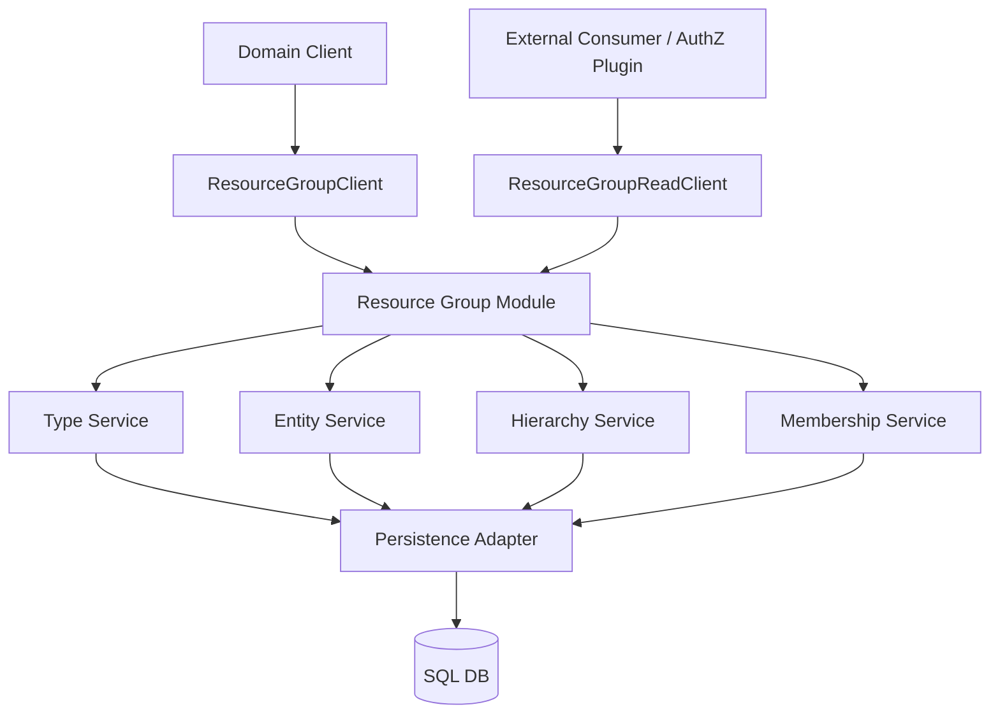
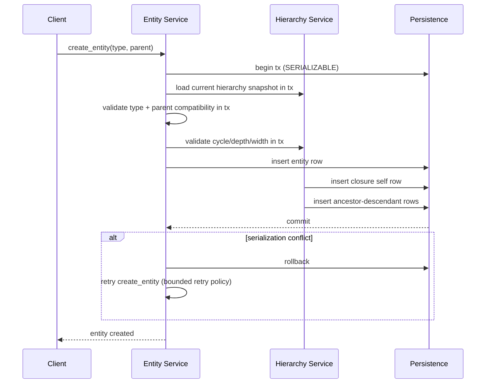
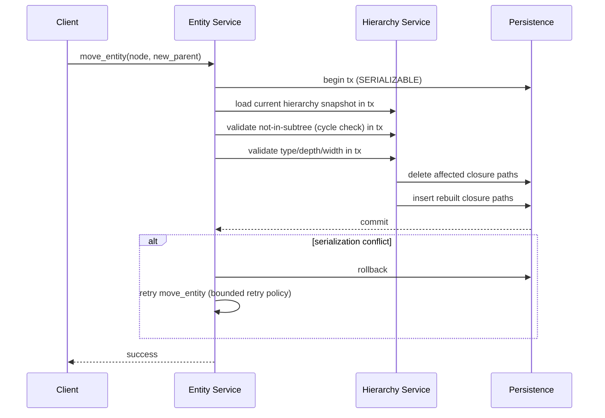
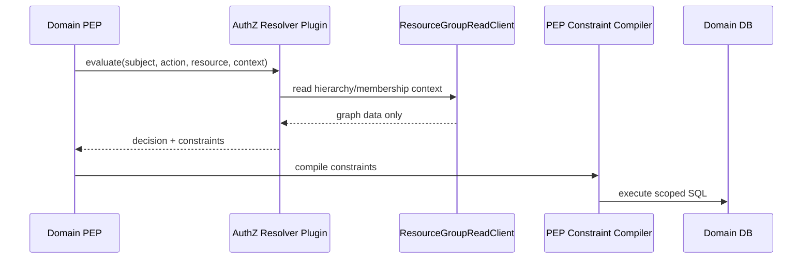

# Technical Design - Resource Group

## 1. Architecture Overview

### 1.1 Architectural Vision

Resource Group is a generic hierarchy and membership module.

It provides:

- dynamic type model
- strict forest entity topology
- closure-table hierarchy read model
- membership links between groups and resources
- read interfaces consumable by external modules/plugins

Resource Group is intentionally policy-agnostic:

- no AuthZ policy evaluation
- no decision semantics
- no SQL filter generation

Cyber Fabric ships this module as the built-in Resource Group provider. Deployments may also use a vendor-specific provider through the same read contracts (resolver/plugin path), similar to Tenant Resolver extensibility.

For AuthZ-facing deployments aligned with current platform architecture, `ownership-graph` is the required profile; provider selection (built-in provider or vendor-specific backend) is deployment-specific.

### 1.2 Architecture Drivers

#### Functional Drivers


| Requirement                                                   | Design Response                                                                                                                       |
| ------------------------------------------------------------- | ------------------------------------------------------------------------------------------------------------------------------------- |
| `cpt-cf-resource-group-fr-manage-types`                       | Type service with validated lifecycle API and uniqueness guarantees.                                                                  |
| `cpt-cf-resource-group-fr-validate-type-code`                 | Type service enforces code format, length, and case-insensitive normalization before persistence.                                     |
| `cpt-cf-resource-group-fr-reject-duplicate-type`              | Unique `code_ci` persistence constraint and deterministic conflict mapping prevent duplicate type creation.                           |
| `cpt-cf-resource-group-fr-seed-types`                         | Deterministic bootstrap seeding path upserts type definitions with stable normalization rules.                                        |
| `cpt-cf-resource-group-fr-delete-type-only-if-empty`          | Type deletion flow checks for existing entities and rejects delete when references remain.                                            |
| `cpt-cf-resource-group-fr-manage-entities`                    | Entity service with create/get/update/move/delete operations.                                                                         |
| `cpt-cf-resource-group-fr-enforce-forest-hierarchy`           | Domain invariants + cycle checks before writes.                                                                                       |
| `cpt-cf-resource-group-fr-validate-parent-type`               | Entity create/move validates parent-child compatibility against runtime type parent rules.                                            |
| `cpt-cf-resource-group-fr-delete-entity-no-active-references` | Delete orchestration applies reference-policy checks before entity removal and closure mutation.                                      |
| `cpt-cf-resource-group-fr-tenant-scope-ownership-graph`       | Ownership-graph profile enforces tenant-hierarchy-compatible parent-child and membership writes, with tenant-scoped AuthZ query path. |
| `cpt-cf-resource-group-fr-manage-membership`                  | Membership service provides deterministic add/remove lifecycle operations.                                                            |
| `cpt-cf-resource-group-fr-query-membership-relations`         | Membership read API supports indexed lookups by group and by resource.                                                                |
| `cpt-cf-resource-group-fr-closure-table`                      | Hierarchy service backed by `resource_group_closure`.                                                                                 |
| `cpt-cf-resource-group-fr-query-group-hierarchy`              | Hierarchy read paths return ancestors/descendants ordered by depth metadata.                                                          |
| `cpt-cf-resource-group-fr-subtree-operations`                 | Subtree move/delete executes closure recalculation inside one transaction boundary.                                                   |
| `cpt-cf-resource-group-fr-query-profile`                      | Optional profile guard checks for depth/width on writes and query paths; limits can be disabled.                                      |
| `cpt-cf-resource-group-fr-profile-change-no-rewrite`          | Profile updates are treated as guardrails only and never rewrite historical hierarchy rows.                                           |
| `cpt-cf-resource-group-fr-reduced-constraints-behavior`       | Tightened profiles allow full reads but reject writes that create/increase depth or width violations.                                 |
| `cpt-cf-resource-group-fr-integration-read-port`              | Read-only consumer contract for hierarchy/membership access.                                                                          |
| `cpt-cf-resource-group-fr-no-authz-and-sql-logic`             | Hard separation: RG returns data only; AuthZ/PEP own constraints/SQL.                                                                 |
| `cpt-cf-resource-group-fr-deterministic-errors`               | Unified error mapper translates domain/infrastructure failures to stable public categories.                                           |


#### NFR Allocation


| NFR ID                                                | NFR Summary                     | Allocated To                                | Design Response                                | Verification      |
| ----------------------------------------------------- | ------------------------------- | ------------------------------------------- | ---------------------------------------------- | ----------------- |
| `cpt-cf-resource-group-nfr-hierarchy-query-latency`   | low-latency hierarchy reads     | hierarchy read paths + closure indexes      | indexed ancestor/descendant lookups            | benchmark suite   |
| `cpt-cf-resource-group-nfr-membership-query-latency`  | low-latency membership reads    | membership service + indexes                | direct lookup by group/resource keys           | benchmark suite   |
| `cpt-cf-resource-group-nfr-transactional-consistency` | transactional write consistency | transaction boundary in persistence adapter | canonical + closure updates commit together    | integration tests |
| `cpt-cf-resource-group-nfr-deterministic-errors`      | stable failures                 | unified error mapper                        | all domain/infra failures mapped to SDK errors | unit tests        |


#### Key Compatibility Anchors


| Document                                          | Constraint                                                                                                  |
| ------------------------------------------------- | ----------------------------------------------------------------------------------------------------------- |
| `docs/arch/authorization/DESIGN.md`               | AuthZ plugin can consume RG data as PIP input; PEP compiles constraints to SQL.                             |
| `docs/arch/authorization/RESOURCE_GROUP_MODEL.md` | AuthZ usage expects tenant-scoped groups with tenant-hierarchy-aware validation for graph/membership links. |
| `modules/system/authz-resolver/docs/PRD.md`       | AuthZ resolver contract unchanged; extension through plugin behavior only.                                  |
| `modules/system/authn-resolver/docs/PRD.md`       | no AuthN/AuthZ responsibility mixing.                                                                       |


### 1.3 Architecture Layers


| Layer                  | Responsibility                                    | Technology                    |
| ---------------------- | ------------------------------------------------- | ----------------------------- |
| API Layer              | expose type/entity/membership + read contracts    | Rust SDK traits + ClientHub   |
| Domain Layer           | validate type compatibility and forest invariants | domain services               |
| Hierarchy Engine       | closure-table updates/queries and profile checks  | domain service + repositories |
| Integration Read Layer | read-only hierarchy/membership projections        | `ResourceGroupReadClient`     |
| Persistence Layer      | transactional storage and indexing                | SQL + SeaORM repositories     |


## 2. Principles & Constraints

### 2.1 Design Principles

#### Policy-Agnostic Core

- `p1` - **ID**: `cpt-cf-resource-group-principle-policy-agnostic`

Resource Group handles graph/membership data only.

#### Strict Forest Integrity

- `p1` - **ID**: `cpt-cf-resource-group-principle-strict-forest`

Hierarchy guarantees single parent and cycle prevention for all writes.

#### Dynamic Type Governance

- `p1` - **ID**: `cpt-cf-resource-group-principle-dynamic-types`

Type rules are runtime-configurable through API/seed data with deterministic validation.

#### Query Profile as Guardrail

- `p1` - **ID**: `cpt-cf-resource-group-principle-query-profile-guardrail`

`(max_depth, max_width)` is a service profile controlling write admissibility and SLO classification.

#### Tenant Scope for Ownership Graph

- `p1` - **ID**: `cpt-cf-resource-group-principle-tenant-scope-ownership-graph`

In ownership-graph usage, groups are tenant-scoped and links must be tenant-hierarchy-compatible (same-tenant or allowed related-tenant link per tenant hierarchy rules).

### 2.2 Constraints

#### No AuthZ Decision Logic

- `p1` - **ID**: `cpt-cf-resource-group-constraint-no-authz-decision`

Resource Group cannot return allow/deny decisions.

#### No SQL/ORM Filter Generation

- `p1` - **ID**: `cpt-cf-resource-group-constraint-no-sql-filter-generation`

Resource Group cannot generate SQL fragments or access-scope objects.

#### Profile Change Safety

- `p1` - **ID**: `cpt-cf-resource-group-constraint-profile-change-safety`

Reducing enabled `max_depth`/`max_width` cannot rewrite existing rows. Writes that worsen violation are rejected until external migration runs. Limits may also be disabled.

## 3. Technical Architecture

### 3.1 Domain Model

**Planned locations**:

- `modules/system/resource-group/resource-group-sdk/src/models.rs`
- `modules/system/resource-group/resource-group-sdk/src/api.rs`
- `modules/system/resource-group/resource-group-sdk/src/error.rs`
- `modules/system/resource-group/resource-group/src/domain/`

**Core entities**:


| Entity                    | Description                                     |
| ------------------------- | ----------------------------------------------- |
| `ResourceGroupType`       | type code, allowed parent types, owner metadata |
| `ResourceGroupEntity`     | group node with optional parent                 |
| `ResourceGroupMembership` | resource-to-group many-to-many link             |
| `ResourceGroupClosure`    | ancestor-descendant-depth projection            |
| `ResourceGroupError`      | deterministic public error taxonomy             |


### 3.2 Component Model




#### Resource Group Module

- `p1` - **ID**: `cpt-cf-resource-group-component-module`

Responsibilities:

- wire services and repositories
- register public clients in ClientHub
- load query profile config
- route `ResourceGroupReadClient` calls to built-in data path or configured vendor-specific plugin path

Boundaries:

- no business rule implementation
- no authz decision logic

#### Type Service

- `p1` - **ID**: `cpt-cf-resource-group-component-type-service`

Responsibilities:

- manage type lifecycle
- validate code format and uniqueness
- enforce delete-if-unused

#### Entity Service

- `p1` - **ID**: `cpt-cf-resource-group-component-entity-service`

Responsibilities:

- create/get/update/move/delete entities
- validate parent type compatibility
- orchestrate subtree operations

#### Hierarchy Service

- `p1` - **ID**: `cpt-cf-resource-group-component-hierarchy-service`

Responsibilities:

- maintain closure table rows
- serve ancestor/descendant queries ordered by depth
- enforce depth/width rules on writes

#### Membership Service

- `p1` - **ID**: `cpt-cf-resource-group-component-membership-service`

Responsibilities:

- add/remove/list membership links
- guard deletion with active-reference checks

#### Integration Read Service

- `p1` - **ID**: `cpt-cf-resource-group-component-integration-read-service`

Responsibilities:

- expose read-only graph/membership queries for external consumers
- remain protocol-neutral and authz-agnostic

#### Persistence Adapter

- `p1` - **ID**: `cpt-cf-resource-group-component-persistence-adapter`

Responsibilities:

- transactional persistence
- index-aware query execution
- consistent canonical + closure updates
- support canonical persistence strategy

Boundaries:

- no domain decisions
- no API semantics

### 3.3 API Contracts

**Core API** (`ResourceGroupClient`, stable):


| Method                                                       | Description                        |
| ------------------------------------------------------------ | ---------------------------------- |
| `create_type` / `update_type` / `delete_type`                | type lifecycle                     |
| `list_types` / `get_type`                                    | type reads                         |
| `create_entity` / `get_entity` / `update_entity`             | entity lifecycle                   |
| `move_entity`                                                | subtree move with invariant checks |
| `delete_entity`                                              | deletion with reference policy     |
| `list_ancestors` / `list_descendants`                        | hierarchy reads                    |
| `add_membership` / `remove_membership`                       | membership lifecycle               |
| `list_memberships_by_resource` / `list_memberships_by_group` | membership reads                   |


Core membership operation shape (target SDK contract fragment):

```rust
use async_trait::async_trait;
use modkit_security::SecurityContext;
use uuid::Uuid;

pub struct AddMembershipRequest {
    pub group_id: Uuid,
    pub resource_id: Uuid,
}

pub struct RemoveMembershipRequest {
    pub group_id: Uuid,
    pub resource_id: Uuid,
}

#[async_trait]
pub trait ResourceGroupClient: Send + Sync {
    async fn add_membership(
        &self,
        ctx: &SecurityContext,
        request: AddMembershipRequest,
    ) -> Result<(), ResourceGroupError>;

    async fn remove_membership(
        &self,
        ctx: &SecurityContext,
        request: RemoveMembershipRequest,
    ) -> Result<(), ResourceGroupError>;
}
```

Core membership operation examples:

```rust
let rg = hub.get::<dyn ResourceGroupClient>()?;

let authz_ctx = SecurityContext::builder()
    .subject_id(caller_subject_id)
    .subject_tenant_id(caller_tenant_id)
    .build()?;

rg.add_membership(
    &authz_ctx,
    AddMembershipRequest {
        group_id: group_a,
        resource_id: task_1,
    },
).await?;

rg.remove_membership(
    &authz_ctx,
    RemoveMembershipRequest {
        group_id: group_a,
        resource_id: task_1,
    },
).await?;
```

Membership write semantics for AuthZ-facing profile:

- in `ownership-graph` mode, add/remove validates tenant scope via caller `SecurityContext` effective scope and target group tenant
- membership row stores explicit `tenant_id` and must match target group tenant
- tenant-incompatible membership writes fail deterministically (`Validation`/`Conflict` mapping)
- no policy decision fields are produced by Resource Group for these operations

Platform-admin provisioning exception:

- privileged platform-admin calls that create/manage tenant hierarchies through `ResourceGroupClient` may run without caller tenant scoping
- this exception applies to provisioning/management operations only, not AuthZ query path
- data invariants remain strict: parent-child and membership links must satisfy tenant hierarchy compatibility rules

**Integration read API** (`ResourceGroupReadClient`, stable):


| Method                                | Description                                                                                                                                                                 |
| ------------------------------------- | --------------------------------------------------------------------------------------------------------------------------------------------------------------------------- |
| `resolve_descendants(ctx, root_id)`   | tenant-scoped descendant rows with `group_id`, `tenant_id`, and depth metadata; rows may include multiple tenant scopes within effective tenant hierarchy scope             |
| `resolve_ancestors(ctx, node_id)`     | tenant-scoped ancestor rows with `group_id`, `tenant_id`, and depth metadata; rows may include multiple tenant scopes within effective tenant hierarchy scope               |
| `resolve_memberships(ctx, group_ids)` | tenant-scoped membership rows with `group_id`, `resource_id`, and `tenant_id` for each row; rows may include multiple tenant scopes within effective tenant hierarchy scope |


Target Rust trait signature (SDK contract, tenant-resolver-style pass-through):

```rust
use async_trait::async_trait;
use modkit_security::SecurityContext;
use uuid::Uuid;

#[derive(Debug, Clone)]
pub struct ResourceGroupHierarchyRow {
    pub group_id: Uuid,
    pub tenant_id: Uuid,
    pub depth: i32,
}

#[derive(Debug, Clone)]
pub struct ResourceGroupMembershipRow {
    pub group_id: Uuid,
    pub tenant_id: Uuid,
    pub resource_id: Uuid,
}

#[async_trait]
pub trait ResourceGroupReadClient: Send + Sync {
    async fn resolve_descendants(
        &self,
        ctx: &SecurityContext,
        root_id: Uuid,
    ) -> Result<Vec<ResourceGroupHierarchyRow>, ResourceGroupError>;

    async fn resolve_ancestors(
        &self,
        ctx: &SecurityContext,
        node_id: Uuid,
    ) -> Result<Vec<ResourceGroupHierarchyRow>, ResourceGroupError>;

    async fn resolve_memberships(
        &self,
        ctx: &SecurityContext,
        group_ids: Vec<Uuid>,
    ) -> Result<Vec<ResourceGroupMembershipRow>, ResourceGroupError>;
}
```

Target plugin trait signature (gateway delegates to selected scoped plugin):

```rust
use async_trait::async_trait;
use modkit_security::SecurityContext;
use uuid::Uuid;

#[async_trait]
pub trait ResourceGroupReadPluginClient: Send + Sync {
    async fn resolve_descendants(
        &self,
        ctx: &SecurityContext,
        root_id: Uuid,
    ) -> Result<Vec<ResourceGroupHierarchyRow>, ResourceGroupError>;

    async fn resolve_ancestors(
        &self,
        ctx: &SecurityContext,
        node_id: Uuid,
    ) -> Result<Vec<ResourceGroupHierarchyRow>, ResourceGroupError>;

    async fn resolve_memberships(
        &self,
        ctx: &SecurityContext,
        group_ids: Vec<Uuid>,
    ) -> Result<Vec<ResourceGroupMembershipRow>, ResourceGroupError>;
}
```

Plugin gateway routing notes:

- `ResourceGroupReadClient` is the public inter-module contract from ClientHub
- module service resolves configured provider:
  - built-in provider: serve reads from local RG persistence path
  - vendor-specific provider: resolve plugin instance by configured vendor and delegate to `ResourceGroupReadPluginClient`
- plugin registration is scoped (GTS instance ID), same pattern as tenant-resolver/authz-resolver gateways
- `SecurityContext` is forwarded without policy interpretation in gateway layer (including plugin path)

Returned models are generic graph/membership objects. They do not encode AuthZ decisions or SQL semantics.

Tenant projection rule for integration reads:

- in `ownership-graph` profile, `tenant_id` is required in every returned row from `ResourceGroupReadClient`
- for membership reads, `tenant_id` is read from `resource_group_membership.tenant_id` (must match `resource_group_entity.tenant_id`)
- rows can legitimately contain different `tenant_id` values when caller effective scope spans tenant hierarchy levels
- this keeps Resource Group policy-agnostic while allowing external PDP logic to validate tenant ownership before producing group-based constraints

Caller identity propagation rule (aligned with Tenant Resolver pattern):

- integration read methods accept caller `SecurityContext` (`ctx`) as the first argument
- Resource Group gateway preserves `ctx` across provider routing (for plugin path, `ctx` is passed through to selected plugin unchanged) without converting it into policy decisions
- plugin implementations decide how/if `ctx` affects read access semantics (for example tenant-scoped visibility or auditing)
- this keeps RG data-only while preserving caller identity required by AuthZ plugin/PDP flows
- for AuthZ query path, reads are tenant-scoped by effective scope derived from caller `SecurityContext.subject_tenant_id`; non-tenant-scoped provisioning exception does not apply

#### Integration Read Schemas (AuthZ-facing)

The integration read contract returns **data rows only** (no policy/decision fields).

`resolve_descendants(ctx, root_id)` and `resolve_ancestors(ctx, node_id)` return hierarchy rows with the same schema:


| Field       | Type | Required                | Description                                                                  |
| ----------- | ---- | ----------------------- | ---------------------------------------------------------------------------- |
| `group_id`  | UUID | Yes                     | Group identifier for the returned row (descendant or ancestor)               |
| `tenant_id` | UUID | Yes (`ownership-graph`) | Tenant scope of `group_id` (can differ per row under tenant hierarchy scope) |
| `depth`     | INT  | Yes                     | Distance from input node (`0` for self row)                                  |


`resolve_memberships(ctx, group_ids)` returns membership rows:


| Field         | Type | Required                | Description                                                                                                                  |
| ------------- | ---- | ----------------------- | ---------------------------------------------------------------------------------------------------------------------------- |
| `group_id`    | UUID | Yes                     | Group identifier from request set                                                                                            |
| `tenant_id`   | UUID | Yes (`ownership-graph`) | Membership tenant scope (stored in membership row; must match group tenant; can differ per row under tenant hierarchy scope) |
| `resource_id` | UUID | Yes                     | Resource identifier                                                                                                          |


Tenant consistency behavior for integration reads:

- in `ownership-graph` profile, rows with missing tenant scope are invalid and must fail with deterministic error mapping
- callers can use returned `tenant_id` to validate row scope against caller effective tenant scope before generating AuthZ group constraints
- in AuthZ query path, mixed-tenant rows are valid when each row tenant is inside effective tenant scope resolved from `ctx`

#### Integration Read Examples

Examples below assume caller effective tenant scope includes:

- `11111111-1111-1111-1111-111111111111` (tenant `T1`, subject tenant)
- `77777777-7777-7777-7777-777777777777` (tenant `T7`, related tenant in hierarchy scope)

Data shape used by all examples (same tenant/group/resource IDs as below):

```text
tenant T1 (11111111-1111-1111-1111-111111111111)
├── department D2 (22222222-2222-2222-2222-222222222222)
│   ├── branch B3 (33333333-3333-3333-3333-333333333333)
│   │   └── resource R4 (44444444-4444-4444-4444-444444444444)
│   └── resource R5 (55555555-5555-5555-5555-555555555555)
├── resource R4 (44444444-4444-4444-4444-444444444444)
├── resource R6 (66666666-6666-6666-6666-666666666666)
└── tenant T7 (77777777-7777-7777-7777-777777777777)
    └── resource R8 (88888888-8888-8888-8888-888888888888)
tenant T9 (99999999-9999-9999-9999-999999999999)
└── resource R0 (00000000-0000-0000-0000-000000000000)
```

Client initialization + caller context:

```rust
use modkit_security::SecurityContext;
use resource_group_sdk::ResourceGroupReadClient;
use uuid::Uuid;

let rg_read = hub.get::<dyn ResourceGroupReadClient>()?;

let authz_ctx = SecurityContext::builder()
    .subject_id(Uuid::new_v4())
    .subject_tenant_id(Uuid::parse_str("11111111-1111-1111-1111-111111111111")?)
    .build()?;
```

`resolve_descendants(root_id)`

```rust
let rows = rg_read
    .resolve_descendants(
        &authz_ctx,
        Uuid::parse_str("22222222-2222-2222-2222-222222222222")?,
    )
    .await?;
```

```json
[
  {
    "group_id": "22222222-2222-2222-2222-222222222222",
    "tenant_id": "11111111-1111-1111-1111-111111111111",
    "depth": 0
  },
  {
    "group_id": "33333333-3333-3333-3333-333333333333",
    "tenant_id": "11111111-1111-1111-1111-111111111111",
    "depth": 1
  }
]
```

`resolve_ancestors(node_id)`

```rust
let rows = rg_read
    .resolve_ancestors(
        &authz_ctx,
        Uuid::parse_str("33333333-3333-3333-3333-333333333333")?,
    )
    .await?;
```

Returns ancestry chain for the requested node (`B3 -> D2 -> T1`).
In this example, tenant root is also returned as an ancestor row.

```json
[
  {
    "group_id": "33333333-3333-3333-3333-333333333333",
    "tenant_id": "11111111-1111-1111-1111-111111111111",
    "depth": 0
  },
  {
    "group_id": "22222222-2222-2222-2222-222222222222",
    "tenant_id": "11111111-1111-1111-1111-111111111111",
    "depth": 1
  },
  {
    "group_id": "11111111-1111-1111-1111-111111111111",
    "tenant_id": "11111111-1111-1111-1111-111111111111",
    "depth": 2
  }
]
```

`resolve_memberships(group_ids)`

```rust
let rows = rg_read
    .resolve_memberships(
        &authz_ctx,
        vec![
            Uuid::parse_str("11111111-1111-1111-1111-111111111111")?,
            Uuid::parse_str("33333333-3333-3333-3333-333333333333")?,
            Uuid::parse_str("77777777-7777-7777-7777-777777777777")?,
        ],
    )
    .await?;
```

```json
[
  {
    "group_id": "11111111-1111-1111-1111-111111111111",
    "tenant_id": "11111111-1111-1111-1111-111111111111",
    "resource_id": "44444444-4444-4444-4444-444444444444"
  },
  {
    "group_id": "11111111-1111-1111-1111-111111111111",
    "tenant_id": "11111111-1111-1111-1111-111111111111",
    "resource_id": "66666666-6666-6666-6666-666666666666"
  },
  {
    "group_id": "33333333-3333-3333-3333-333333333333",
    "tenant_id": "11111111-1111-1111-1111-111111111111",
    "resource_id": "44444444-4444-4444-4444-444444444444"
  },
  {
    "group_id": "77777777-7777-7777-7777-777777777777",
    "tenant_id": "77777777-7777-7777-7777-777777777777",
    "resource_id": "88888888-8888-8888-8888-888888888888"
  }
]
```

### 3.4 Internal Dependencies


| Dependency           | Purpose                                     |
| -------------------- | ------------------------------------------- |
| `resource-group-sdk` | contracts/models/errors                     |
| `modkit/client_hub`  | inter-module client registration and lookup |


### 3.5 External Dependencies


| Dependency                            | Interface                       | Purpose                                                       |
| ------------------------------------- | ------------------------------- | ------------------------------------------------------------- |
| SQL database                          | SeaORM repositories             | durable canonical + closure storage                           |
| Vendor-specific RG backend (optional) | `ResourceGroupReadPluginClient` | alternative hierarchy/membership source for integration reads |
| AuthZ plugin consumer (optional)      | `ResourceGroupReadClient`       | read hierarchy/membership context in PDP logic                |


### 3.6 Interactions & Sequences

#### Create Entity With Parent

**ID**: `cpt-cf-resource-group-seq-create-entity-with-parent`




#### Move Subtree

**ID**: `cpt-cf-resource-group-seq-move-subtree`




Write-concurrency rule for hierarchy mutations (`create/move/delete`):

- authoritative invariant checks MUST run inside the same write transaction that applies closure/entity mutations
- write transactions SHOULD use `SERIALIZABLE` isolation for deterministic safety under concurrent moves/creates
- serialization conflicts are handled by bounded retry with deterministic error mapping when retries are exhausted

#### AuthZ + RG + SQL Responsibility Split

**ID**: `cpt-cf-resource-group-seq-authz-rg-sql-split`




This is the fixed boundary:

- RG returns graph data only.
- AuthZ plugin creates constraints.
- PEP/compiler creates SQL.

### 3.7 Database schemas & tables

#### Table: `resource_group_type`


| Column       | Type        | Description                        |
| ------------ | ----------- | ---------------------------------- |
| `code`       | TEXT        | original type code                 |
| `code_ci`    | TEXT        | normalized lowercase code (unique) |
| `parents`    | JSON/TEXT[] | allowed parent type codes          |
| `owner_id`   | UUID        | owner identifier                   |
| `created_at` | TIMESTAMP   | creation time                      |
| `updated_at` | TIMESTAMP   | update time                        |


Constraints:

- PK/UNIQUE on `code_ci`

#### Table: `resource_group_entity`


| Column         | Type      | Description                                       |
| -------------- | --------- | ------------------------------------------------- |
| `id`           | UUIDv7    | entity ID                                         |
| `type_code_ci` | TEXT      | normalized type code                              |
| `tenant_id`    | UUID NULL | tenant scope (required for ownership-graph usage) |
| `parent_id`    | UUID NULL | parent entity                                     |
| `name`         | TEXT      | display name                                      |
| `external_id`  | TEXT NULL | optional external ID                              |
| `created_at`   | TIMESTAMP | creation time                                     |
| `updated_at`   | TIMESTAMP | update time                                       |


Note:

- In `resource_group_entity`, API field `type_code` is accepted in any case and normalized before persistence; the system stores this normalized value in `type_code_ci` for case-insensitive lookups and uniqueness checks.

Indexes:

- `(parent_id)`
- `(type_code_ci)`
- `(tenant_id, parent_id)`
- optional `(external_id)`

#### Table: `resource_group_membership`


| Column        | Type      | Description                    |
| ------------- | --------- | ------------------------------ |
| `tenant_id`   | UUID      | tenant scope of membership row |
| `group_id`    | UUID      | group entity ID                |
| `resource_id` | UUID      | resource identifier            |
| `created_at`  | TIMESTAMP | creation time                  |


Constraints/indexes:

- PK `(group_id, resource_id)`
- index `(tenant_id, group_id)`
- index `(tenant_id, resource_id)`
- in ownership-graph usage, `tenant_id` is persisted on write, validated against operation context for tenant-scoped callers, and must match `resource_group_entity.tenant_id`

#### Table: `resource_group_closure`


| Column          | Type | Description                |
| --------------- | ---- | -------------------------- |
| `ancestor_id`   | UUID | ancestor (parent on path)  |
| `descendant_id` | UUID | descendant (child on path) |
| `depth`         | INT  | distance, 0 for self       |


Constraints/indexes:

- PK `(ancestor_id, descendant_id)`
- index `(descendant_id)`
- self-row required for each entity (`ancestor_id = descendant_id`, `depth = 0`)

Compatibility note:

- AuthZ predicates require only `ancestor_id/descendant_id`.
- `depth` is additional metadata for ordered hierarchy reads.

### 3.8 Query Profile Enforcement

Config:

- `max_depth`: optional positive integer, default `10` (recommended for default performance profile), configurable without hard upper bound; `null`/absent disables depth limit
- `max_width`: optional positive integer; `null`/absent disables width limit

Enforcement rules:

- reads are not truncated when stored data already violates tightened profile
- writes are rejected when they create/increase violation for enabled limits:
  - `DepthLimitExceeded`
  - `WidthLimitExceeded`

Profile reduction for enabled limits requires external operator migration to restore compliance.

Ownership-graph tenant enforcement:

- parent-child edges must be tenant-hierarchy-compatible (same-tenant or allowed related-tenant link)
- membership row `tenant_id` must match target group tenant; tenant-scoped callers must stay within effective tenant scope from `subject_tenant_id`
- platform-admin provisioning calls may bypass caller-tenant scope checks, but cannot create tenant-incompatible links
- violations return deterministic conflict/validation errors

### 3.9 Error Mapping


| Failure                     | Public Error               |
| --------------------------- | -------------------------- |
| invalid input               | `Validation`               |
| missing type/entity         | `NotFound`                 |
| duplicate type              | `TypeAlreadyExists`        |
| invalid parent type         | `InvalidParentType`        |
| cycle attempt               | `CycleDetected`            |
| active references on delete | `ConflictActiveReferences` |
| depth/width violation       | `LimitViolation`           |
| infra timeout/unavailable   | `ServiceUnavailable`       |
| unexpected failure          | `Internal`                 |


## 4. Additional Context

- AuthN/AuthZ module contracts remain unchanged.
- AuthZ extensibility is implemented through plugin behavior that consumes RG read contracts.
- Resource Group provider is swappable by configuration (built-in module or vendor-specific provider) without changing consumer contracts.
- SQL conversion remains in existing PEP flow (`PolicyEnforcer` + compiler), consistent with approved architecture.

## 5. Traceability

- **PRD**: [PRD.md](./PRD.md)
- **Auth Architecture Context**: [docs/arch/authorization/DESIGN.md](../../../../docs/arch/authorization/DESIGN.md)
- **Resource Group Model Context**: [docs/arch/authorization/RESOURCE_GROUP_MODEL.md](../../../../docs/arch/authorization/RESOURCE_GROUP_MODEL.md)
