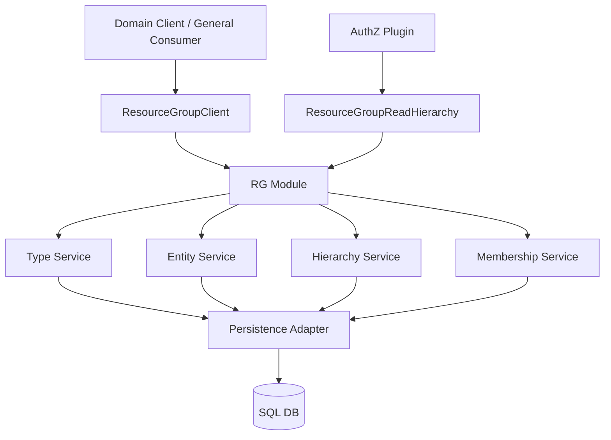
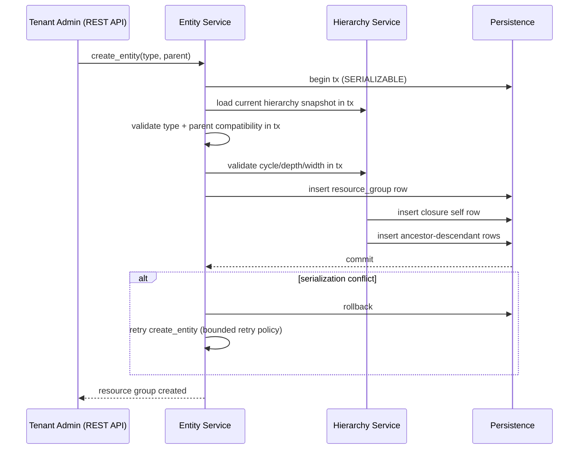
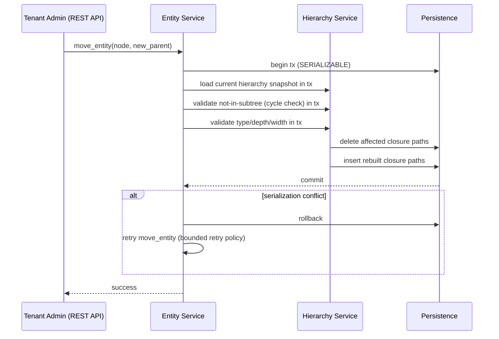
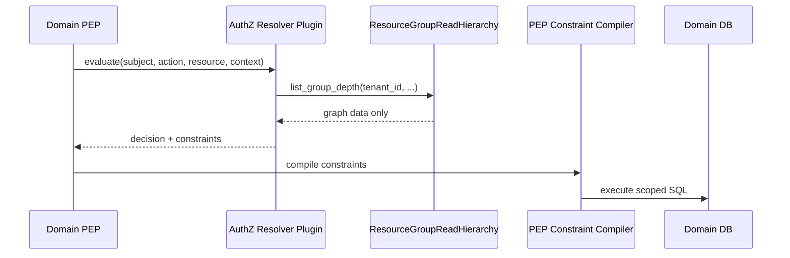
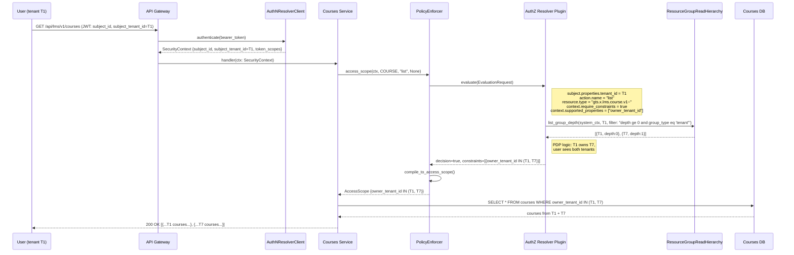
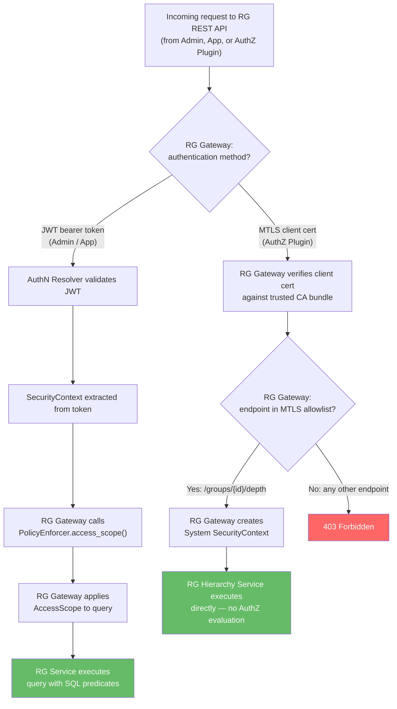
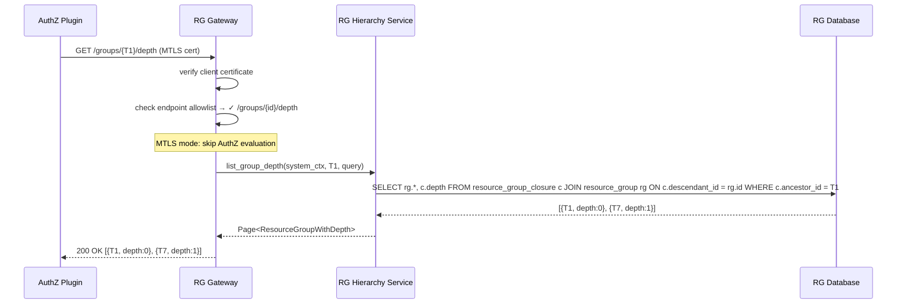
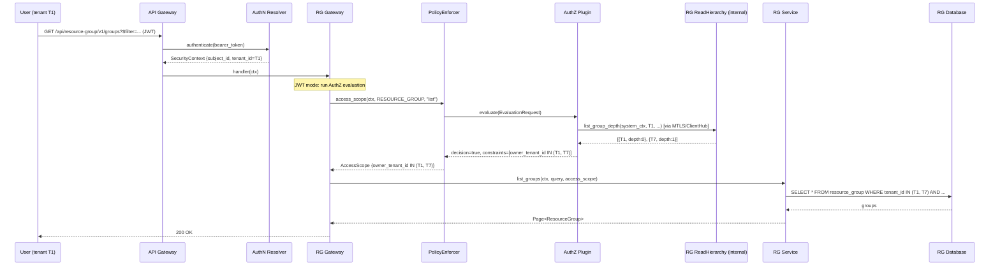

# Technical Design - Resource Group (RG)

> **Abbreviation**: Resource Group = **RG**. Used throughout this document.

## 1. Architecture Overview

### 1.1 Architectural Vision

RG is a generic hierarchy and membership module.

It provides:

- dynamic type model
- strict forest entity topology
- closure-table hierarchy read model
- membership links between groups and resources
- read interfaces consumable by external modules/plugins

RG is intentionally policy-agnostic:

- no AuthZ policy evaluation
- no decision semantics
- no SQL filter generation

The architecture consists of:

- **RG Resolver SDK** — read and write trait contracts (`ResourceGroupClient`, `ResourceGroupReadHierarchy`)
- **RG Module (Gateway)** — routes requests to built-in or vendor-specific provider
- **RG Plugin** — full service with database, REST API, seeding, and domain logic

Deployments use either: (RG Plugin + RG Service) or (Vendor RG Plugin + Vendor RG Service) — both behind the same SDK contracts.

AuthZ can operate without RG. RG is an optional PIP data source for AuthZ plugin logic.

For AuthZ-facing deployments aligned with current platform architecture, `ownership-graph` is the required profile; provider selection (built-in provider or vendor-specific backend) is deployment-specific.

### 1.2 Architecture Drivers

#### Functional Drivers


| Requirement                                                   | Design Response                                                                                                                       |
| ------------------------------------------------------------- | ------------------------------------------------------------------------------------------------------------------------------------- |
| `cpt-cf-resource-group-fr-rest-api`                           | REST API layer with OperationBuilder and OData query support.                                                                         |
| `cpt-cf-resource-group-fr-odata-query`                        | OData `$filter`, `$top`, `$skip` on all list endpoints.                                                                               |
| `cpt-cf-resource-group-fr-list-groups-depth`                  | Dedicated depth endpoint (`/{group_id}/depth`) returns hierarchy with relative depth and depth-based filtering.                       |
| `cpt-cf-resource-group-fr-manage-types`                       | Type service with validated lifecycle API and uniqueness guarantees.                                                                  |
| `cpt-cf-resource-group-fr-validate-type-code`                 | Type service enforces code format, length, and case-insensitive normalization before persistence.                                     |
| `cpt-cf-resource-group-fr-reject-duplicate-type`              | Unique `code_ci` persistence constraint and deterministic conflict mapping prevent duplicate type creation.                           |
| `cpt-cf-resource-group-fr-seed-types`                         | Plugin-level deterministic pre-deployment seeding path upserts type definitions with stable normalization rules.                      |
| `cpt-cf-resource-group-fr-seed-groups`                        | Plugin-level deterministic pre-deployment seeding path creates/updates group hierarchy with parent-child and type validation.         |
| `cpt-cf-resource-group-fr-seed-memberships`                   | Plugin-level deterministic pre-deployment seeding path creates membership links with group existence and tenant compatibility validation. |
| `cpt-cf-resource-group-fr-delete-type-only-if-empty`          | Type deletion flow checks for existing entities and rejects delete when references remain.                                            |
| `cpt-cf-resource-group-fr-manage-entities`                    | Entity service with create/get/update/move/delete operations.                                                                         |
| `cpt-cf-resource-group-fr-enforce-forest-hierarchy`           | Domain invariants + cycle checks before writes.                                                                                       |
| `cpt-cf-resource-group-fr-validate-parent-type`               | Entity create/move validates parent-child compatibility against runtime type parent rules.                                            |
| `cpt-cf-resource-group-fr-delete-entity-no-active-references` | Delete orchestration applies reference-policy checks before entity removal and closure mutation.                                      |
| `cpt-cf-resource-group-fr-tenant-scope-ownership-graph`       | Ownership-graph profile enforces tenant-hierarchy-compatible parent-child and membership writes, with tenant-scoped AuthZ query path. |
| `cpt-cf-resource-group-fr-manage-membership`                  | Membership service provides deterministic add/remove lifecycle operations.                                                            |
| `cpt-cf-resource-group-fr-query-membership-relations`         | Membership read API supports indexed lookups by group and by resource.                                                                |
| `cpt-cf-resource-group-fr-closure-table`                      | Hierarchy service backed by `resource_group_closure`.                                                                                 |
| `cpt-cf-resource-group-fr-query-group-hierarchy`              | Hierarchy read paths return ancestors/descendants ordered by depth metadata.                                                          |
| `cpt-cf-resource-group-fr-subtree-operations`                 | Subtree move/delete executes closure recalculation inside one transaction boundary.                                                   |
| `cpt-cf-resource-group-fr-query-profile`                      | Optional profile guard checks for depth/width on writes and query paths; limits can be disabled.                                      |
| `cpt-cf-resource-group-fr-profile-change-no-rewrite`          | Profile updates are treated as guardrails only and never rewrite historical hierarchy rows.                                           |
| `cpt-cf-resource-group-fr-reduced-constraints-behavior`       | Tightened profiles allow full reads but reject writes that create/increase depth or width violations.                                 |
| `cpt-cf-resource-group-fr-integration-read-port`              | Read-only consumer contract for hierarchy/membership access.                                                                          |
| `cpt-cf-resource-group-fr-no-authz-and-sql-logic`             | Hard separation: RG returns data only; AuthZ/PEP own constraints/SQL.                                                                 |
| `cpt-cf-resource-group-fr-deterministic-errors`               | Unified error mapper translates domain/infrastructure failures to stable public categories.                                           |
| `cpt-cf-resource-group-fr-force-delete`                       | Delete orchestration supports optional `force` parameter for cascade deletion of subtree and memberships.                             |
| `cpt-cf-resource-group-fr-dual-auth-modes`                    | RG Gateway supports JWT (all endpoints, AuthZ-evaluated) and MTLS (hierarchy-only, AuthZ-bypassed) authentication paths.             |


#### NFR Allocation


| NFR ID                                                | NFR Summary                     | Allocated To                                | Design Response                                | Verification      |
| ----------------------------------------------------- | ------------------------------- | ------------------------------------------- | ---------------------------------------------- | ----------------- |
| `cpt-cf-resource-group-nfr-hierarchy-query-latency`   | low-latency hierarchy reads     | hierarchy read paths + closure indexes      | indexed ancestor/descendant lookups            | benchmark suite   |
| `cpt-cf-resource-group-nfr-membership-query-latency`  | low-latency membership reads    | membership service + indexes                | direct lookup by group/resource keys           | benchmark suite   |
| `cpt-cf-resource-group-nfr-transactional-consistency` | transactional write consistency | transaction boundary in persistence adapter | canonical + closure updates commit together    | integration tests |
| `cpt-cf-resource-group-nfr-deterministic-errors`      | stable failures                 | unified error mapper                        | all domain/infra failures mapped to SDK errors | unit tests        |
| `cpt-cf-resource-group-nfr-production-scale`          | projected production volumes    | schema design + index strategy              | composite indexes, partitioning candidate for membership table (~455M rows, ~110 GB) | capacity planning |


#### Key Compatibility Anchors


| Document                                          | Constraint                                                                                                  |
| ------------------------------------------------- | ----------------------------------------------------------------------------------------------------------- |
| `docs/arch/authorization/DESIGN.md`               | AuthZ plugin can consume RG data as PIP input; PEP compiles constraints to SQL.                             |
| `docs/arch/authorization/RESOURCE_GROUP_MODEL.md` | AuthZ usage expects tenant-scoped groups with tenant-hierarchy-aware validation for graph/membership links. |
| `modules/system/authz-resolver/docs/PRD.md`       | AuthZ resolver contract unchanged; extension through plugin behavior only.                                  |
| `modules/system/authn-resolver/docs/PRD.md`       | no AuthN/AuthZ responsibility mixing.                                                                       |


### 1.3 Architecture Layers


| Layer                  | Responsibility                                    | Technology                    |
| ---------------------- | ------------------------------------------------- | ----------------------------- |
| REST API Layer         | HTTP endpoints with OData query support           | OperationBuilder + REST handlers |
| SDK API Layer          | expose type/entity/membership + read contracts    | Rust SDK traits + ClientHub   |
| Domain Layer           | validate type compatibility and forest invariants | domain services               |
| Hierarchy Engine       | closure-table updates/queries and profile checks  | domain service + repositories |
| Integration Read Layer | read-only hierarchy queries for AuthZ plugin      | `ResourceGroupReadHierarchy`  |
| Persistence Layer      | transactional storage and indexing                | SQL + SeaORM repositories     |


## 2. Principles & Constraints

### 2.1 Design Principles

#### Policy-Agnostic Core

- [ ] `p1` - **ID**: `cpt-cf-resource-group-principle-policy-agnostic`

RG handles graph/membership data only.

#### Strict Forest Integrity

- [ ] `p1` - **ID**: `cpt-cf-resource-group-principle-strict-forest`

Hierarchy guarantees single parent and cycle prevention for all writes.

#### Dynamic Type Governance

- [ ] `p1` - **ID**: `cpt-cf-resource-group-principle-dynamic-types`

Type rules are runtime-configurable through API/seed data with deterministic validation.

#### Query Profile as Guardrail

- [ ] `p1` - **ID**: `cpt-cf-resource-group-principle-query-profile-guardrail`

`(max_depth, max_width)` is a service profile controlling write admissibility and SLO classification.

#### Tenant Scope for Ownership Graph

- [ ] `p1` - **ID**: `cpt-cf-resource-group-principle-tenant-scope-ownership-graph`

In ownership-graph usage, groups are tenant-scoped and links must be tenant-hierarchy-compatible (same-tenant or allowed related-tenant link per tenant hierarchy rules).

### 2.2 Constraints

#### No AuthZ Decision Logic

- [ ] `p1` - **ID**: `cpt-cf-resource-group-constraint-no-authz-decision`

RG cannot return allow/deny decisions.

#### No SQL/ORM Filter Generation

- [ ] `p1` - **ID**: `cpt-cf-resource-group-constraint-no-sql-filter-generation`

RG cannot generate SQL fragments or access-scope objects.

#### Database-Agnostic Persistence

- [ ] `p1` - **ID**: `cpt-cf-resource-group-constraint-db-agnostic`

RG persistence layer uses SeaORM abstractions and standard SQL. The module **MUST NOT** depend on vendor-specific SQL extensions or features of a particular RDBMS. Any SQL-compatible database supported by SeaORM can be used as the storage backend.

#### Profile Change Safety

- [ ] `p1` - **ID**: `cpt-cf-resource-group-constraint-profile-change-safety`

Reducing enabled `max_depth`/`max_width` cannot rewrite existing rows. Writes that worsen violation are rejected until external migration runs. Limits may also be disabled.

## 3. Technical Architecture

### 3.1 Domain Model

**Planned locations**:

- `modules/system/resource-group/resource-group-sdk/src/models.rs` — SDK models and DTOs
- `modules/system/resource-group/resource-group-sdk/src/api.rs` — SDK trait contracts
- `modules/system/resource-group/resource-group-sdk/src/error.rs` — SDK error types
- `modules/system/resource-group/resource-group/src/domain/` — domain services and invariants
- `modules/system/resource-group/resource-group/src/api/` — REST API handlers

**Core entities**:


| Entity                    | Description                                                         |
| ------------------------- | ------------------------------------------------------------------- |
| `ResourceGroupType`       | type code and allowed parent types                                  |
| `ResourceGroupEntity`     | group node with optional parent, stored in `resource_group` table   |
| `ResourceGroupMembership` | resource-to-group many-to-many link, qualified by `resource_type`   |
| `ResourceGroupClosure`    | ancestor-descendant-depth projection                                |
| `ResourceGroupError`      | deterministic public error taxonomy                                 |


### 3.2 Component Model


```mermaid
graph TD
    A[Domain Client / General Consumer] --> B[ResourceGroupClient]
    X[AuthZ Plugin] --> Z[ResourceGroupReadHierarchy]
    B --> D[RG Module]
    Z --> D
    D --> E[Type Service]
    D --> F[Entity Service]
    D --> G[Hierarchy Service]
    D --> H[Membership Service]
    E --> I[Persistence Adapter]
    F --> I
    G --> I
    H --> I
    I --> J[(SQL DB)]
```

AuthZ plugin depends only on the narrow `ResourceGroupReadHierarchy` trait (hierarchy-only). All other consumers (domain clients, general consumers) use `ResourceGroupClient` (full CRUD including reads).


#### RG Module (Gateway)

- [ ] `p1` - **ID**: `cpt-cf-resource-group-component-module`

Responsibilities:

- wire services and repositories
- register public clients in ClientHub
- expose REST API endpoints under `/api/resource-group/v1/`
- load query profile config
- route `ResourceGroupReadHierarchy` calls to built-in data path or configured vendor-specific plugin path

Boundaries:

- no business rule implementation
- no authz decision logic

#### Type Service

- [ ] `p1` - **ID**: `cpt-cf-resource-group-component-type-service`

Responsibilities:

- manage type lifecycle
- validate code format and uniqueness
- enforce delete-if-unused

#### Entity Service

- [ ] `p1` - **ID**: `cpt-cf-resource-group-component-entity-service`

Responsibilities:

- create/get/update/move/delete entities
- validate parent type compatibility (on create, move, and group_type change)
- orchestrate subtree operations

#### Hierarchy Service

- [ ] `p1` - **ID**: `cpt-cf-resource-group-component-hierarchy-service`

Responsibilities:

- maintain closure table rows
- serve ancestor/descendant queries ordered by depth
- enforce depth/width rules on writes

#### Membership Service

- [ ] `p1` - **ID**: `cpt-cf-resource-group-component-membership-service`

Responsibilities:

- add/remove/list membership links
- guard deletion with active-reference checks

#### Integration Read Service

- [ ] `p1` - **ID**: `cpt-cf-resource-group-component-integration-read-service`

Responsibilities:

- expose read-only graph/membership queries for external consumers
- remain protocol-neutral and authz-agnostic

#### Persistence Adapter

- [ ] `p1` - **ID**: `cpt-cf-resource-group-component-persistence-adapter`

Responsibilities:

- transactional persistence
- index-aware query execution
- consistent canonical + closure updates
- support canonical persistence strategy

Boundaries:

- no domain decisions
- no API semantics

### 3.3 API Contracts

**Core API** (`ResourceGroupClient`, stable):


| Method | Returns | Description |
| ------ | ------- | ----------- |
| `create_type` / `update_type` | `ResourceGroupType` | type lifecycle |
| `get_type` | `ResourceGroupType` | get type by code |
| `list_types` | `Page<ResourceGroupType>` | list types with OData query |
| `delete_type` | `()` | delete type |
| `create_group` / `update_group` | `ResourceGroup` | group lifecycle |
| `get_group` | `ResourceGroup` | get group by ID |
| `list_groups` | `Page<ResourceGroup>` | list groups with OData query |
| `delete_group` | `()` | delete group (optional `force`) |
| `list_group_depth` | `Page<ResourceGroupWithDepth>` | traverse hierarchy from reference group with relative depth |
| `add_membership` | `ResourceGroupMembership` | add membership |
| `remove_membership` | `()` | remove membership |
| `list_memberships` | `Page<ResourceGroupMembership>` | list memberships with OData query |


SDK models (aligned with REST API schemas):

```rust
use uuid::Uuid;

// ── Type ────────────────────────────────────────────────────────────────

/// Matches REST `Type` schema.
#[derive(Debug, Clone)]
pub struct ResourceGroupType {
    pub code: String,
    pub parents: Vec<String>,
}

/// Matches REST `CreateTypeRequest` schema.
#[derive(Debug, Clone)]
pub struct CreateTypeRequest {
    pub code: String,
    pub parents: Vec<String>,
}

/// Matches REST `UpdateTypeRequest` schema.
#[derive(Debug, Clone)]
pub struct UpdateTypeRequest {
    pub parents: Vec<String>,
}

// ── Group ───────────────────────────────────────────────────────────────

/// Matches REST `Group` schema.
#[derive(Debug, Clone)]
pub struct ResourceGroup {
    pub group_id: Uuid,
    pub parent_id: Option<Uuid>,
    pub group_type: String,
    pub name: String,
    pub tenant_id: Uuid,
    pub external_id: Option<String>,
}

/// Matches REST `GroupWithDepth` schema.
#[derive(Debug, Clone)]
pub struct ResourceGroupWithDepth {
    pub group_id: Uuid,
    pub parent_id: Option<Uuid>,
    pub group_type: String,
    pub name: String,
    pub tenant_id: Uuid,
    pub external_id: Option<String>,
    pub depth: i32,
}

/// Matches REST `CreateGroupRequest` schema.
#[derive(Debug, Clone)]
pub struct CreateGroupRequest {
    pub group_type: String,
    pub name: String,
    pub parent_id: Option<Uuid>,
    pub tenant_id: Uuid,
    pub external_id: Option<String>,
}

/// Matches REST `UpdateGroupRequest` schema.
#[derive(Debug, Clone)]
pub struct UpdateGroupRequest {
    pub group_type: String,
    pub name: String,
    pub parent_id: Option<Uuid>,
    pub external_id: Option<String>,
}

// ── Membership ──────────────────────────────────────────────────────────

/// Matches REST `Membership` schema.
#[derive(Debug, Clone)]
pub struct ResourceGroupMembership {
    pub group_id: Uuid,
    pub resource_type: String,
    pub resource_id: String,
}

/// Matches REST `addMembership` / `deleteMembership` path params.
#[derive(Debug, Clone)]
pub struct AddMembershipRequest {
    pub group_id: Uuid,
    pub resource_type: String,
    pub resource_id: String,
}

/// Matches REST `addMembership` / `deleteMembership` path params.
#[derive(Debug, Clone)]
pub struct RemoveMembershipRequest {
    pub group_id: Uuid,
    pub resource_type: String,
    pub resource_id: String,
}

// ── Pagination ──────────────────────────────────────────────────────────

/// Matches REST `PageInfo` schema.
#[derive(Debug, Clone)]
pub struct PageInfo {
    pub top: i32,
    pub skip: i32,
}

/// Generic paginated response. Matches REST `*Page` schemas.
#[derive(Debug, Clone)]
pub struct Page<T> {
    pub items: Vec<T>,
    pub page_info: PageInfo,
}
```

Core API trait shape (target SDK contract fragment):

```rust
use async_trait::async_trait;
use modkit_security::SecurityContext;
use uuid::Uuid;

#[async_trait]
pub trait ResourceGroupClient: Send + Sync {
    // ── Type lifecycle ──────────────────────────────────────────────
    async fn create_type(&self, ctx: &SecurityContext, request: CreateTypeRequest) -> Result<ResourceGroupType, ResourceGroupError>;
    async fn get_type(&self, ctx: &SecurityContext, code: &str) -> Result<ResourceGroupType, ResourceGroupError>;
    async fn list_types(&self, ctx: &SecurityContext, query: ListQuery) -> Result<Page<ResourceGroupType>, ResourceGroupError>;
    async fn update_type(&self, ctx: &SecurityContext, code: &str, request: UpdateTypeRequest) -> Result<ResourceGroupType, ResourceGroupError>;
    async fn delete_type(&self, ctx: &SecurityContext, code: &str) -> Result<(), ResourceGroupError>;

    // ── Group lifecycle ─────────────────────────────────────────────
    async fn create_group(&self, ctx: &SecurityContext, request: CreateGroupRequest) -> Result<ResourceGroup, ResourceGroupError>;
    async fn get_group(&self, ctx: &SecurityContext, group_id: Uuid) -> Result<ResourceGroup, ResourceGroupError>;
    async fn list_groups(&self, ctx: &SecurityContext, query: ListQuery) -> Result<Page<ResourceGroup>, ResourceGroupError>;
    async fn update_group(&self, ctx: &SecurityContext, group_id: Uuid, request: UpdateGroupRequest) -> Result<ResourceGroup, ResourceGroupError>;
    async fn delete_group(&self, ctx: &SecurityContext, group_id: Uuid, force: bool) -> Result<(), ResourceGroupError>;

    // ── Hierarchy ───────────────────────────────────────────────────
    async fn list_group_depth(&self, ctx: &SecurityContext, group_id: Uuid, query: ListQuery) -> Result<Page<ResourceGroupWithDepth>, ResourceGroupError>;

    // ── Membership lifecycle ────────────────────────────────────────
    async fn add_membership(&self, ctx: &SecurityContext, request: AddMembershipRequest) -> Result<ResourceGroupMembership, ResourceGroupError>;
    async fn remove_membership(&self, ctx: &SecurityContext, request: RemoveMembershipRequest) -> Result<(), ResourceGroupError>;
    async fn list_memberships(&self, ctx: &SecurityContext, query: ListQuery) -> Result<Page<ResourceGroupMembership>, ResourceGroupError>;
}
```

Core API usage examples:

```rust
let rg = hub.get::<dyn ResourceGroupClient>()?;

let authz_ctx = SecurityContext::builder()
    .subject_id(caller_subject_id)
    .subject_tenant_id(caller_tenant_id)
    .build()?;

rg.add_membership(
    &authz_ctx,
    AddMembershipRequest {
        group_id: group_a,
        resource_type: "User".to_string(),
        resource_id: "task_1".to_string(),
    },
).await?;

rg.remove_membership(
    &authz_ctx,
    RemoveMembershipRequest {
        group_id: group_a,
        resource_type: "User".to_string(),
        resource_id: "task_1".to_string(),
    },
).await?;
```

Membership write semantics for AuthZ-facing profile:

- membership operations are keyed by `(group_id, resource_type, resource_id)`
- in `ownership-graph` mode, add/remove validates tenant scope via caller `SecurityContext` effective scope and target group tenant
- membership tenant scope is derived from the target group's `tenant_id` via `group_id` (JOIN, not stored on membership row)
- tenant-incompatible membership writes fail deterministically (`TenantIncompatibility` error mapping)
- no policy decision fields are produced by RG for these operations

Platform-admin provisioning exception:

- privileged platform-admin calls that create/manage tenant hierarchies through `ResourceGroupClient` may run without caller tenant scoping
- this exception applies to provisioning/management operations only, not AuthZ query path
- data invariants remain strict: parent-child and membership links must satisfy tenant hierarchy compatibility rules

#### REST API Endpoints

Base path: `/api/resource-group/v1`

| Method | Path | Operation | Description |
| ------ | ---- | --------- | ----------- |
| GET | `/types` | `listTypes` | List types with OData query |
| POST | `/types` | `createType` | Create type |
| GET | `/types/{code}` | `getType` | Get type by code |
| PUT | `/types/{code}` | `updateType` | Update type |
| DELETE | `/types/{code}` | `deleteType` | Delete type |
| GET | `/groups` | `listGroups` | List groups with OData query |
| POST | `/groups` | `createGroup` | Create group (explicit `tenant_id` in body) |
| GET | `/groups/{group_id}` | `getGroup` | Get group by ID |
| PUT | `/groups/{group_id}` | `updateGroup` | Update group (including parent move) |
| DELETE | `/groups/{group_id}` | `deleteGroup` | Delete group (optional `?force=true`) |
| GET | `/groups/{group_id}/depth` | `listGroupDepth` | Traverse hierarchy from reference group with relative depth |
| GET | `/memberships` | `listMemberships` | List memberships with OData query |
| POST | `/memberships/{group_id}/{resource_type}/{resource_id}` | `addMembership` | Add membership |
| DELETE | `/memberships/{group_id}/{resource_type}/{resource_id}` | `deleteMembership` | Remove membership |

OData query support on all list endpoints:

- `$filter` — field-specific operators (eq, ne, in)
- `$top` — page size (1..300, default 50)
- `$skip` — offset (default 0)

Group list (`listGroups`) `$filter` fields: `group_type` (eq, ne, in), `parent_id` (eq, ne, in), `group_id` (eq, ne, in), `name` (eq, ne, in), `external_id` (eq, ne, in).

Group depth (`listGroupDepth`) `$filter` fields: `depth` (eq, ne, gt, ge, lt, le), `group_type` (eq, ne, in).

Membership list `$filter` fields: `resource_id` (eq, ne, in), `resource_type` (eq, ne, in), `group_id` (eq, ne, in).

REST API field projection notes:

- Group responses (`Group` schema) do not include `created`/`modified` timestamps. These fields exist in the database for audit purposes but are not exposed in API responses.
- Membership list responses (`Membership` schema) do not include `tenant_id`. Memberships are always scoped to a single tenant; tenant scope is derived from the group's `tenant_id` via `group_id` JOIN and is not stored on the membership row itself.

Type list `$filter` fields: `code` (eq, ne, in).

**Integration read API** (stable, two-tier trait hierarchy):

`ResourceGroupReadHierarchy` is a narrow hierarchy-only read contract used exclusively by AuthZ plugin. All other consumers use `ResourceGroupClient` which includes the same read operations plus full CRUD.

| Trait | Method | Description |
| ----- | ------ | ----------- |
| `ResourceGroupReadHierarchy` | `list_group_depth(ctx, group_id, query)` | hierarchy traversal with relative `depth`; matches REST `GET /groups/{group_id}/depth` — supports OData `$filter` (depth, group_type), `$top`, `$skip` |

Integration read models reuse the same SDK structs defined above:

- `list_group_depth` returns `Page<ResourceGroupWithDepth>` (matches REST `GroupWithDepthPage`)
- `list_memberships` (on `ResourceGroupClient`) returns `Page<ResourceGroupMembership>` (matches REST `MembershipPage` — no `tenant_id`; tenant scope is available from group data the caller already has via `list_group_depth`)

Target Rust trait signature (SDK contract):

```rust
use async_trait::async_trait;
use modkit_security::SecurityContext;
use uuid::Uuid;

/// Narrow hierarchy-only read contract.
/// Used by AuthZ plugin — provides only hierarchy traversal, no memberships.
#[async_trait]
pub trait ResourceGroupReadHierarchy: Send + Sync {
    /// Matches REST `GET /groups/{group_id}/depth` with OData query.
    async fn list_group_depth(
        &self,
        ctx: &SecurityContext,
        group_id: Uuid,
        query: ListQuery,
    ) -> Result<Page<ResourceGroupWithDepth>, ResourceGroupError>;
}
```

Target plugin trait signature (gateway delegates to selected scoped plugin):

```rust
use async_trait::async_trait;
use modkit_security::SecurityContext;
use uuid::Uuid;

/// Plugin hierarchy read contract. Extends `ResourceGroupReadHierarchy`.
#[async_trait]
pub trait ResourceGroupReadPluginClient: ResourceGroupReadHierarchy {
    async fn list_memberships(
        &self,
        ctx: &SecurityContext,
        query: ListQuery,
    ) -> Result<Page<ResourceGroupMembership>, ResourceGroupError>;
}
```

ClientHub registration (single implementation, three registrations):

```rust
let svc: Arc<RgService> = Arc::new(RgService::new(/* ... */));

// Full read+write client: hub.get::<dyn ResourceGroupClient>()
hub.register::<dyn ResourceGroupClient>(svc.clone());

// AuthZ plugin: hub.get::<dyn ResourceGroupReadHierarchy>()
hub.register::<dyn ResourceGroupReadHierarchy>(svc.clone());
```

Plugin gateway routing notes:

- `ResourceGroupClient` is the full read+write contract for type/entity/membership lifecycle and hierarchy queries (used by domain clients and general consumers)
- `ResourceGroupReadHierarchy` is the narrow read-only contract for AuthZ plugin (hierarchy only)
- both are registered in ClientHub backed by the same implementation
- module service resolves configured provider:
  - built-in provider: serve reads from local RG persistence path
  - vendor-specific provider: resolve plugin instance by configured vendor and delegate to `ResourceGroupReadPluginClient`
- plugin registration is scoped (GTS instance ID), same pattern as tenant-resolver/authz-resolver gateways
- `SecurityContext` is forwarded without policy interpretation in gateway layer (including plugin path)

Returned models are generic graph/membership objects. They do not encode AuthZ decisions or SQL semantics.

Tenant projection rule for integration reads:

- hierarchy reads (`list_group_depth`) return `ResourceGroupWithDepth` which includes `tenant_id` per group — callers use this to validate tenant scope
- membership reads (`list_memberships`) return `ResourceGroupMembership` without `tenant_id` — callers derive tenant scope from group data already obtained via hierarchy reads
- rows from hierarchy reads can legitimately contain different `tenant_id` values when caller effective scope spans tenant hierarchy levels
- this keeps RG policy-agnostic while allowing external PDP logic to validate tenant ownership before producing group-based constraints

Caller identity propagation rule (aligned with Tenant Resolver pattern):

- integration read methods accept caller `SecurityContext` (`ctx`) as the first argument
- RG gateway preserves `ctx` across provider routing (for plugin path, `ctx` is passed through to selected plugin unchanged) without converting it into policy decisions
- plugin implementations decide how/if `ctx` affects read access semantics (for example tenant-scoped visibility or auditing)
- this keeps RG data-only while preserving caller identity required by AuthZ plugin/PDP flows
- for AuthZ query path, reads are tenant-scoped by effective scope derived from caller `SecurityContext.subject_tenant_id`; non-tenant-scoped provisioning exception does not apply

#### Integration Read Schemas (AuthZ-facing)

The integration read contract returns **data rows only** (no policy/decision fields). Schemas match REST API models exactly.

`list_group_depth(ctx, group_id, query)` returns `Page<ResourceGroupWithDepth>` (matches REST `GET /groups/{group_id}/depth` → `GroupWithDepthPage`):


| Field         | Type        | Required | Description                                                                  |
| ------------- | ----------- | -------- | ---------------------------------------------------------------------------- |
| `group_id`    | UUID        | Yes      | Group identifier                                                             |
| `parent_id`   | UUID / null | No       | Parent group (null for root groups)                                          |
| `group_type`  | string      | Yes      | Type code                                                                    |
| `name`        | string      | Yes      | Display name                                                                 |
| `tenant_id`   | UUID        | Yes      | Tenant scope (can differ per row under tenant hierarchy scope)               |
| `external_id` | string / null | No     | Optional external ID                                                         |
| `depth`       | INT         | Yes      | Relative distance from reference group (`0` = self, positive = descendants, negative = ancestors) |

OData filters for `list_group_depth`: `depth` (eq, ne, gt, ge, lt, le), `group_type` (eq, ne, in). Pagination: `$top`, `$skip`.

`list_memberships(ctx, query)` returns `Page<ResourceGroupMembership>` (matches REST `GET /memberships` → `MembershipPage`):


| Field           | Type   | Required | Description                           |
| --------------- | ------ | -------- | ------------------------------------- |
| `group_id`      | UUID   | Yes      | Group identifier                      |
| `resource_type` | string | Yes      | Resource type classification          |
| `resource_id`   | string | Yes      | Resource identifier                   |

OData filters for `list_memberships`: `group_id` (eq, ne, in), `resource_type` (eq, ne, in), `resource_id` (eq, ne, in). Pagination: `$top`, `$skip`.

Membership rows do not include `tenant_id`. Callers derive tenant scope from group data obtained via `list_group_depth`.

Tenant consistency behavior for integration reads:

- hierarchy rows include `tenant_id` per group — callers validate row scope against effective tenant scope before generating AuthZ group constraints
- membership rows are keyed by `group_id` — callers map `group_id → tenant_id` from hierarchy data
- in AuthZ query path, mixed-tenant rows are valid when each row tenant is inside effective tenant scope resolved from `ctx`

#### Integration Read Examples

Examples below assume caller effective tenant scope includes:

- `11111111-1111-1111-1111-111111111111` (tenant `T1`, subject tenant)
- `77777777-7777-7777-7777-777777777777` (tenant `T7`, related tenant in hierarchy scope)

Data shape used by all examples (same tenant/group/resource IDs as below):

```text
tenant T1 (11111111-1111-1111-1111-111111111111)
├── department D2 (22222222-2222-2222-2222-222222222222)
│   ├── branch B3 (33333333-3333-3333-3333-333333333333)
│   │   └── resource R4
│   └── resource R5
├── resource R4
├── resource R6
└── tenant T7 (77777777-7777-7777-7777-777777777777)
    └── resource R8
tenant T9 (99999999-9999-9999-9999-999999999999)
└── resource R0
```

Client initialization + caller context:

```rust
use modkit_security::SecurityContext;
use resource_group_sdk::{ResourceGroupClient, ResourceGroupReadHierarchy};
use uuid::Uuid;

// AuthZ plugin — hierarchy only
let rg_hierarchy = hub.get::<dyn ResourceGroupReadHierarchy>()?;

// General consumer — full CRUD including reads
let rg = hub.get::<dyn ResourceGroupClient>()?;

let authz_ctx = SecurityContext::builder()
    .subject_id(Uuid::new_v4())
    .subject_tenant_id(Uuid::parse_str("11111111-1111-1111-1111-111111111111")?)
    .build()?;
```

`list_group_depth` — descendants (matches REST `GET /groups/{D2}/depth?$filter=depth ge 0`)

```rust
let page = rg
    .list_group_depth(
        &authz_ctx,
        Uuid::parse_str("22222222-2222-2222-2222-222222222222")?,
        ListQuery::new().filter("depth ge 0"),
    )
    .await?;
```

```json
{
  "items": [
    {
      "group_id": "22222222-2222-2222-2222-222222222222",
      "parent_id": "11111111-1111-1111-1111-111111111111",
      "group_type": "department",
      "name": "D2",
      "tenant_id": "11111111-1111-1111-1111-111111111111",
      "external_id": "D2",
      "depth": 0
    },
    {
      "group_id": "33333333-3333-3333-3333-333333333333",
      "parent_id": "22222222-2222-2222-2222-222222222222",
      "group_type": "branch",
      "name": "B3",
      "tenant_id": "11111111-1111-1111-1111-111111111111",
      "external_id": "B3",
      "depth": 1
    }
  ],
  "page_info": { "top": 50, "skip": 0 }
}
```

`list_group_depth` — ancestors (matches REST `GET /groups/{B3}/depth?$filter=depth ge -10 and depth le 0`)

```rust
let page = rg
    .list_group_depth(
        &authz_ctx,
        Uuid::parse_str("33333333-3333-3333-3333-333333333333")?,
        ListQuery::new().filter("depth ge -10 and depth le 0"),
    )
    .await?;
```

Returns ancestry chain for the requested node (`T1 → D2 → B3`).

```json
{
  "items": [
    {
      "group_id": "11111111-1111-1111-1111-111111111111",
      "parent_id": null,
      "group_type": "tenant",
      "name": "T1",
      "tenant_id": "11111111-1111-1111-1111-111111111111",
      "external_id": "T1",
      "depth": -2
    },
    {
      "group_id": "22222222-2222-2222-2222-222222222222",
      "parent_id": "11111111-1111-1111-1111-111111111111",
      "group_type": "department",
      "name": "D2",
      "tenant_id": "11111111-1111-1111-1111-111111111111",
      "external_id": "D2",
      "depth": -1
    },
    {
      "group_id": "33333333-3333-3333-3333-333333333333",
      "parent_id": "22222222-2222-2222-2222-222222222222",
      "group_type": "branch",
      "name": "B3",
      "tenant_id": "11111111-1111-1111-1111-111111111111",
      "external_id": "B3",
      "depth": 0
    }
  ],
  "page_info": { "top": 50, "skip": 0 }
}
```

`list_memberships` — by group_ids (matches REST `GET /memberships?$filter=group_id in (...)`)

```rust
let page = rg
    .list_memberships(
        &authz_ctx,
        ListQuery::new().filter(
            "group_id in ('11111111-1111-1111-1111-111111111111','33333333-3333-3333-3333-333333333333','77777777-7777-7777-7777-777777777777')"
        ),
    )
    .await?;
```

```json
{
  "items": [
    {
      "group_id": "11111111-1111-1111-1111-111111111111",
      "resource_type": "User",
      "resource_id": "R4"
    },
    {
      "group_id": "11111111-1111-1111-1111-111111111111",
      "resource_type": "User",
      "resource_id": "R6"
    },
    {
      "group_id": "33333333-3333-3333-3333-333333333333",
      "resource_type": "User",
      "resource_id": "R4"
    },
    {
      "group_id": "77777777-7777-7777-7777-777777777777",
      "resource_type": "User",
      "resource_id": "R8"
    }
  ],
  "page_info": { "top": 50, "skip": 0 }
}
```

### 3.4 Internal Dependencies


| Dependency           | Purpose                                     |
| -------------------- | ------------------------------------------- |
| `resource-group-sdk` | contracts/models/errors                     |
| `modkit/client_hub`  | inter-module client registration and lookup |


### 3.5 External Dependencies


| Dependency                            | Interface                       | Purpose                                                       |
| ------------------------------------- | ------------------------------- | ------------------------------------------------------------- |
| SQL database                          | SeaORM repositories             | durable canonical + closure storage                           |
| AuthZ Resolver SDK                    | `PolicyEnforcer` / `AuthZResolverClient` | AuthZ evaluation for JWT-authenticated RG API requests (write + read) |
| Vendor-specific RG backend (optional) | `ResourceGroupReadPluginClient` | alternative hierarchy/membership source for integration reads |
| AuthZ plugin consumer (optional)      | `ResourceGroupReadHierarchy`    | read hierarchy context in PDP logic (narrow, hierarchy-only, MTLS/in-process) |
| General consumers (optional)          | `ResourceGroupClient`           | full read+write access to types/entities/memberships/hierarchy |


### 3.6 Interactions & Sequences

#### Create Resource Group With Parent

**ID**: `cpt-cf-resource-group-seq-create-entity-with-parent`

Tenant Administrator creates a child resource group (e.g. department, branch) under an existing parent group via REST API `POST /groups`. Other callers — Instance Administrator (REST API) and Apps (`ResourceGroupClient` SDK) — follow the same internal flow.


```mermaid
sequenceDiagram
    participant TA as Tenant Admin (REST API)
    participant ES as Entity Service
    participant HS as Hierarchy Service
    participant DB as Persistence

    TA->>ES: create_entity(type, parent)
    ES->>DB: begin tx (SERIALIZABLE)
    ES->>HS: load current hierarchy snapshot in tx
    ES->>ES: validate type + parent compatibility in tx
    ES->>HS: validate cycle/depth/width in tx
    ES->>DB: insert resource_group row
    HS->>DB: insert closure self row
    HS->>DB: insert ancestor-descendant rows
    DB-->>ES: commit
    alt serialization conflict
        ES->>DB: rollback
        ES->>ES: retry create_entity (bounded retry policy)
    end
    ES-->>TA: resource group created
```


#### Move Resource Group Subtree

**ID**: `cpt-cf-resource-group-seq-move-subtree`

Tenant Administrator moves a resource group (and its entire subtree) to a new parent within the same tenant via REST API `PUT /groups/{group_id}`. Other callers — Instance Administrator (REST API) and Apps (`ResourceGroupClient` SDK) — follow the same internal flow.


```mermaid
sequenceDiagram
    participant TA as Tenant Admin (REST API)
    participant ES as Entity Service
    participant HS as Hierarchy Service
    participant DB as Persistence

    TA->>ES: move_entity(node, new_parent)
    ES->>DB: begin tx (SERIALIZABLE)
    ES->>HS: load current hierarchy snapshot in tx
    ES->>HS: validate not-in-subtree (cycle check) in tx
    ES->>HS: validate type/depth/width in tx
    HS->>DB: delete affected closure paths
    HS->>DB: insert rebuilt closure paths
    DB-->>ES: commit
    alt serialization conflict
        ES->>DB: rollback
        ES->>ES: retry move_entity (bounded retry policy)
    end
    ES-->>TA: success
```


Write-concurrency rule for hierarchy mutations (`create/move/delete`):

- authoritative invariant checks MUST run inside the same write transaction that applies closure/entity mutations
- write transactions MUST use `SERIALIZABLE` isolation to prevent phantom reads between cycle-check and closure/entity insert under concurrent hierarchy mutations; `SERIALIZABLE` is the recommended default
- serialization conflicts are handled by bounded retry with deterministic error mapping when retries are exhausted

#### AuthZ + RG + SQL Responsibility Split

**ID**: `cpt-cf-resource-group-seq-authz-rg-sql-split`


```mermaid
sequenceDiagram
    participant PEP as Domain PEP
    participant AZ as AuthZ Resolver Plugin
    participant RG as ResourceGroupReadHierarchy
    participant CMP as PEP Constraint Compiler
    participant DB as Domain DB

    PEP->>AZ: evaluate(subject, action, resource, context)
    AZ->>RG: list_group_depth(tenant_id, ...)
    RG-->>AZ: graph data only
    AZ-->>PEP: decision + constraints
    PEP->>CMP: compile constraints
    CMP->>DB: execute scoped SQL
```


This is the fixed boundary:

- RG returns graph data only.
- AuthZ plugin creates constraints.
- PEP/compiler creates SQL.

#### Module Initialization Order

**ID**: `cpt-cf-resource-group-seq-init-order`

RG Management API depends on AuthZ SDK; AuthZ plugin depends on RG Access API SDK. This circular dependency is resolved by phased initialization:

```
Phase 1 (SystemCapability):
  1. RG Module init
     → registers ResourceGroupClient in ClientHub
     → registers ResourceGroupReadHierarchy in ClientHub
     → REST/gRPC endpoints NOT yet accepting traffic

  2. AuthZ Resolver init (deps: [types-registry])
     → registers AuthZResolverClient in ClientHub
     → plugin discovery is lazy (first evaluate() call)

Phase 2 (ready):
  3. RG Module starts accepting REST/gRPC traffic
     → write operations call PolicyEnforcer → AuthZResolverClient (available since step 2)
     → seed operations run as pre-deployment step with system SecurityContext (bypass AuthZ)

  4. AuthZ plugin on first evaluate() call
     → lazy-discovers RG plugin via types-registry
     → calls ResourceGroupReadHierarchy (available since step 1)
```

There is no deadlock: RG registers its read clients before AuthZ initializes, and AuthZ registers its client before RG starts accepting write traffic. Seed operations run as a pre-deployment step with a system-level `SecurityContext` and bypass the AuthZ evaluation path.

#### End-to-End Authorization Flow (Example)

**ID**: `cpt-cf-resource-group-seq-e2e-authz-flow`

Concrete example: a user of tenant `T1` requests a list of courses. The tenant hierarchy grants access to courses in `T1` and its child tenant `T7`.

```text
Tenant hierarchy:
  tenant T1 (11111111-...)
  └── tenant T7 (77777777-...)
  tenant T9 (99999999-...)
```


```mermaid
sequenceDiagram
    participant U as User (tenant T1)
    participant GW as API Gateway
    participant AN as AuthNResolverClient
    participant CS as Courses Service
    participant PE as PolicyEnforcer
    participant AZ as AuthZ Resolver Plugin
    participant RG as ResourceGroupReadHierarchy
    participant DB as Courses DB

    U->>GW: GET /api/lms/v1/courses (JWT: subject_id, subject_tenant_id=T1)
    GW->>AN: authenticate(bearer_token)
    AN-->>GW: SecurityContext {subject_id, subject_tenant_id=T1, token_scopes}
    GW->>CS: handler(ctx: SecurityContext)

    CS->>PE: access_scope(ctx, COURSE, "list", None)
    PE->>AZ: evaluate(EvaluationRequest)
    Note right of AZ: subject.properties.tenant_id = T1<br/>action.name = "list"<br/>resource.type = "gts.x.lms.course.v1~"<br/>context.require_constraints = true<br/>context.supported_properties = ["owner_tenant_id"]

    AZ->>RG: list_group_depth(system_ctx, T1, filter: "depth ge 0 and group_type eq 'tenant'")
    RG-->>AZ: [{T1, depth:0}, {T7, depth:1}]
    Note right of AZ: PDP logic: T1 owns T7,<br/>user sees both tenants

    AZ-->>PE: decision=true, constraints=[{owner_tenant_id IN (T1, T7)}]
    PE->>PE: compile_to_access_scope()
    PE-->>CS: AccessScope {owner_tenant_id IN (T1, T7)}

    CS->>DB: SELECT * FROM courses WHERE owner_tenant_id IN (T1, T7)
    DB-->>CS: courses from T1 + T7
    CS-->>U: 200 OK [{...T1 courses...}, {...T7 courses...}]
```

Step-by-step:

1. **AuthN** — API Gateway extracts JWT bearer token, calls `AuthNResolverClient.authenticate()`. The authn plugin validates the token and returns a `SecurityContext` with `subject_id`, `subject_tenant_id = T1`, and `token_scopes`. Gateway injects `SecurityContext` into request extensions.

2. **Domain service** — Courses handler receives the request with `SecurityContext`. Before querying the database, it calls `PolicyEnforcer.access_scope(&ctx, &COURSE_RESOURCE, "list", None)` to obtain row-level access constraints.

3. **AuthZ evaluation** — `PolicyEnforcer` builds an `EvaluationRequest` (subject with `tenant_id = T1`, action `"list"`, resource type `"gts.x.lms.course.v1~"`, `require_constraints = true`, `supported_properties = ["owner_tenant_id"]`) and calls `AuthZResolverClient.evaluate()`.

4. **Hierarchy resolution** — The AuthZ plugin calls `ResourceGroupReadHierarchy.list_group_depth()` with `tenant_id = T1` and a depth filter to resolve the tenant hierarchy. RG returns `[T1 (depth 0), T7 (depth 1)]` — the accessible tenant subtree. The plugin does NOT see `T9` because it is outside `T1`'s hierarchy.

5. **Constraint generation** — The AuthZ plugin applies its policy logic to the hierarchy data and produces constraints: `owner_tenant_id IN (T1, T7)`. This is returned in `EvaluationResponse` with `decision = true`.

6. **Constraint compilation** — `PolicyEnforcer` calls `compile_to_access_scope()` which converts the PDP constraints into an `AccessScope` with `ScopeFilter::in("owner_tenant_id", [T1, T7])`.

7. **SQL execution** — Courses service applies the `AccessScope` via SecureORM, which appends `WHERE owner_tenant_id IN ('T1', 'T7')` to the query. The user sees courses from both tenants.

Key separation of concerns:

| Component | Knows about | Does NOT know about |
| --------- | ----------- | ------------------- |
| Courses service | course domain, SQL schema | tenant hierarchy, access policies |
| AuthZ plugin | access policies, tenant hierarchy (via RG) | courses, SQL schema |
| RG | hierarchy data, group membership | courses, access policies, SQL |

#### RG Authentication Modes: JWT vs MTLS

**ID**: `cpt-cf-resource-group-seq-auth-modes`

RG Module exposes its REST/gRPC API with **two authentication modes**. The mode determines whether the request passes through AuthZ evaluation.

##### Mode 1: JWT (public API — all endpoints)

Standard user/service requests authenticated via JWT bearer token. **All** RG REST API endpoints are available. Every request goes through AuthZ evaluation via `PolicyEnforcer`, same as any other domain service (e.g. courses).

Applies to:
- `GET /api/resource-group/v1/types` — list/get types
- `POST/PUT/DELETE /api/resource-group/v1/types/{code}` — type lifecycle
- `GET /api/resource-group/v1/groups` — list/get groups
- `POST/PUT/DELETE /api/resource-group/v1/groups/{group_id}` — group lifecycle
- `GET /api/resource-group/v1/groups/{group_id}/depth` — hierarchy traversal
- `GET /api/resource-group/v1/memberships` — list memberships
- `POST/DELETE /api/resource-group/v1/memberships/{...}` — membership lifecycle

##### Mode 2: MTLS (private API — hierarchy endpoint only)

Service-to-service requests authenticated via mutual TLS client certificate. Used exclusively by AuthZ plugin to read tenant hierarchy. **Only one endpoint** is available in MTLS mode:

- `GET /api/resource-group/v1/groups/{group_id}/depth` — hierarchy traversal

All other endpoints return `403 Forbidden` in MTLS mode. This is enforced by RG gateway-level allowlist, not by AuthZ evaluation.

MTLS requests **bypass AuthZ evaluation entirely** — no `PolicyEnforcer` call, no `access_evaluation_request`. This is critical because:
1. AuthZ plugin **is the caller** — it cannot evaluate itself (circular dependency)
2. MTLS certificate identity is a trusted system principal — access is granted by transport-level authentication
3. The single allowed endpoint returns read-only hierarchy data — minimal attack surface

##### Authentication Decision Flow

RG Gateway receives requests from two types of callers and routes them through different authentication paths:

- **JWT path** — Admin (Instance/Tenant) or App sends a request with a bearer token. RG Gateway delegates authentication to AuthN Resolver, then runs AuthZ evaluation via `PolicyEnforcer` before executing the query.
- **MTLS path** — AuthZ Plugin (in microservice deployment) sends a request with a client certificate. RG Gateway verifies the certificate against a trusted CA bundle, checks the endpoint allowlist, and executes directly without AuthZ evaluation.


```mermaid
flowchart TD
    REQ["Incoming request to RG REST API<br/>(from Admin, App, or AuthZ Plugin)"] --> AUTH_CHECK{RG Gateway:<br/>authentication method?}

    AUTH_CHECK -->|"JWT bearer token<br/>(Admin / App)"| JWT_PATH[AuthN Resolver validates JWT]
    JWT_PATH --> SEC_CTX[SecurityContext extracted from token]
    SEC_CTX --> AUTHZ["RG Gateway calls<br/>PolicyEnforcer.access_scope()"]
    AUTHZ --> CONSTRAINTS[RG Gateway applies<br/>AccessScope to query]
    CONSTRAINTS --> EXEC["RG Service executes<br/>query with SQL predicates"]

    AUTH_CHECK -->|"MTLS client cert<br/>(AuthZ Plugin)"| MTLS_PATH["RG Gateway verifies client cert<br/>against trusted CA bundle"]
    MTLS_PATH --> ENDPOINT_CHECK{RG Gateway:<br/>endpoint in MTLS allowlist?}
    ENDPOINT_CHECK -->|"Yes: /groups/{id}/depth"| SYSTEM_CTX["RG Gateway creates<br/>System SecurityContext"]
    SYSTEM_CTX --> EXEC_DIRECT["RG Hierarchy Service executes<br/>directly — no AuthZ evaluation"]
    ENDPOINT_CHECK -->|No: any other endpoint| REJECT[403 Forbidden]

    style REJECT fill:#f66,color:#fff
    style EXEC_DIRECT fill:#6b6,color:#fff
    style EXEC fill:#6b6,color:#fff
```

##### Sequence: MTLS request from AuthZ plugin

**ID**: `cpt-cf-resource-group-seq-mtls-authz-read`


```mermaid
sequenceDiagram
    participant AZ as AuthZ Plugin
    participant RG_GW as RG Gateway
    participant RG_SVC as RG Hierarchy Service
    participant DB as RG Database

    AZ->>RG_GW: GET /groups/{T1}/depth (MTLS cert)
    RG_GW->>RG_GW: verify client certificate
    RG_GW->>RG_GW: check endpoint allowlist → ✓ /groups/{id}/depth

    Note over RG_GW: MTLS mode: skip AuthZ evaluation

    RG_GW->>RG_SVC: list_group_depth(system_ctx, T1, query)
    RG_SVC->>DB: SELECT rg.*, c.depth FROM resource_group_closure c JOIN resource_group rg ON c.descendant_id = rg.id WHERE c.ancestor_id = T1
    DB-->>RG_SVC: [{T1, depth:0}, {T7, depth:1}]
    RG_SVC-->>RG_GW: Page<ResourceGroupWithDepth>
    RG_GW-->>AZ: 200 OK [{T1, depth:0}, {T7, depth:1}]
```

##### Sequence: JWT request from user to RG (same AuthZ flow as any domain service)

**ID**: `cpt-cf-resource-group-seq-jwt-rg-request`


```mermaid
sequenceDiagram
    participant U as User (tenant T1)
    participant GW as API Gateway
    participant AN as AuthN Resolver
    participant RG_GW as RG Gateway
    participant PE as PolicyEnforcer
    participant AZ as AuthZ Plugin
    participant RG_HIER as RG ReadHierarchy (internal)
    participant RG_SVC as RG Service
    participant DB as RG Database

    U->>GW: GET /api/resource-group/v1/groups?$filter=... (JWT)
    GW->>AN: authenticate(bearer_token)
    AN-->>GW: SecurityContext {subject_id, tenant_id=T1}
    GW->>RG_GW: handler(ctx)

    Note over RG_GW: JWT mode: run AuthZ evaluation

    RG_GW->>PE: access_scope(ctx, RESOURCE_GROUP, "list")
    PE->>AZ: evaluate(EvaluationRequest)
    AZ->>RG_HIER: list_group_depth(system_ctx, T1, ...) [via MTLS/ClientHub]
    RG_HIER-->>AZ: [{T1, depth:0}, {T7, depth:1}]
    AZ-->>PE: decision=true, constraints=[owner_tenant_id IN (T1, T7)]
    PE-->>RG_GW: AccessScope {owner_tenant_id IN (T1, T7)}

    RG_GW->>RG_SVC: list_groups(ctx, query, access_scope)
    RG_SVC->>DB: SELECT * FROM resource_group WHERE tenant_id IN (T1, T7) AND ...
    DB-->>RG_SVC: groups
    RG_SVC-->>RG_GW: Page<ResourceGroup>
    RG_GW-->>U: 200 OK
```

Note: when a user calls RG REST API with JWT, the AuthZ flow is **identical** to any other domain service (courses, users, etc.):
1. API Gateway authenticates JWT → `SecurityContext`
2. RG gateway calls `PolicyEnforcer.access_scope()` → AuthZ evaluates → constraints returned
3. RG applies `AccessScope` to its own query via SecureORM (SecureORM maps AuthZ property `owner_tenant_id` to actual column `tenant_id` in `resource_group` table)
4. AuthZ plugin internally reads hierarchy via `ResourceGroupReadHierarchy` (MTLS or in-process ClientHub) — this internal read bypasses AuthZ

The key insight: RG is simultaneously a **consumer** of AuthZ (for its own JWT-authenticated endpoints) and a **data provider** for AuthZ (via MTLS/ClientHub hierarchy reads). The MTLS bypass prevents the circular call.

##### MTLS Configuration and Certificate Verification

MTLS authentication is configured at the RG gateway level and includes two parts: certificate trust and endpoint allowlist.

**Certificate verification process** (performed by RG Gateway on every MTLS request):

1. RG Gateway extracts the client certificate from the TLS handshake.
2. Certificate is validated against the trusted CA bundle (`ca_cert`): signature chain, expiration, revocation status.
3. Client identity (certificate `CN` / `SAN`) is matched against `allowed_clients` list. If the client is not in the list, the request is rejected with `403 Forbidden`.
4. Only after identity verification, the endpoint is checked against `allowed_endpoints`. If the endpoint is not in the allowlist, `403 Forbidden` is returned.

```yaml
modules:
  resource_group:
    mtls:
      enabled: true
      # Trusted CA bundle for verifying client certificates.
      # In production: internal PKI CA that issues service certificates.
      ca_cert: /etc/ssl/certs/internal-ca.pem
      # Clients allowed to connect via MTLS (matched by certificate CN).
      allowed_clients:
        - cn: authz-resolver-plugin
      # Endpoints reachable via MTLS. All other endpoints return 403.
      allowed_endpoints:
        - method: GET
          path: /api/resource-group/v1/groups/{group_id}/depth
```

Only explicitly listed method+path combinations are reachable via MTLS. Any request to an unlisted endpoint returns `403 Forbidden` regardless of certificate validity. Similarly, a valid certificate from a client not in `allowed_clients` is rejected.

##### In-Process vs Out-of-Process

| Deployment | AuthZ → RG hierarchy read | Auth mechanism |
| ---------- | ------------------------- | -------------- |
| Monolith (single process) | `hub.get::<dyn ResourceGroupReadHierarchy>()` — direct in-process call via ClientHub | No network auth needed — trusted in-process call, system `SecurityContext` |
| Microservices (separate processes) | gRPC/REST call to RG service | MTLS client certificate — only `/groups/{id}/depth` endpoint allowed |

In both cases, the AuthZ plugin uses `ResourceGroupReadHierarchy` trait. The trait implementation is either a direct local call (monolith) or an MTLS-authenticated remote call (microservices). The RG gateway applies the same allowlist logic in both cases — but in monolith mode, the in-process ClientHub path skips the gateway entirely (no HTTP, no MTLS, no allowlist check needed — the type system enforces that only `list_group_depth` is callable via `dyn ResourceGroupReadHierarchy`).

### 3.7 Database schemas & tables

#### Table: `resource_group_type`


| Column     | Type        | Description               |
| ---------- | ----------- | ------------------------- |
| `code`     | TEXT        | type code (PK)            |
| `parents`  | TEXT[]      | allowed parent type codes (min 1 element); `''` (empty string) permits root placement; `[]` is invalid |
| `created`  | TIMESTAMPTZ | creation time             |
| `modified` | TIMESTAMPTZ | update time (nullable)    |


Constraints:

- PK on `code`
- unique functional index on `LOWER(code)` for case-insensitive uniqueness

#### Table: `resource_group`


| Column        | Type        | Description                                       |
| ------------- | ----------- | ------------------------------------------------- |
| `id`          | UUID        | entity ID (PK, default `gen_random_uuid()`)       |
| `parent_id`   | UUID NULL   | parent entity (FK to `resource_group.id`)         |
| `group_type`  | TEXT        | type code (FK to `resource_group_type.code`)      |
| `name`        | TEXT        | display name                                      |
| `tenant_id`   | UUID        | tenant scope                                      |
| `external_id` | TEXT NULL   | optional external ID                              |
| `created`     | TIMESTAMPTZ | creation time                                     |
| `modified`    | TIMESTAMPTZ | update time (nullable)                            |


Constraints:

- FK `group_type` → `resource_group_type(code)` ON UPDATE CASCADE ON DELETE RESTRICT
- FK `parent_id` → `resource_group(id)` ON UPDATE CASCADE ON DELETE RESTRICT

Indexes:

- `(parent_id)`
- `(name)`
- `(external_id)`
- `(group_type, id)` — composite for type-scoped queries

#### Table: `resource_group_membership`


| Column          | Type        | Description                                |
| --------------- | ----------- | ------------------------------------------ |
| `group_id`      | UUID        | group entity ID (FK to `resource_group.id`)|
| `resource_type` | TEXT        | caller-defined resource classification     |
| `resource_id`   | TEXT        | caller-defined resource identifier         |
| `created`       | TIMESTAMPTZ | creation time                              |

Tenant scope is not stored on membership rows. It is derived from `resource_group.tenant_id` via JOIN on `group_id`.

Constraints/indexes:

- UNIQUE `(group_id, resource_type, resource_id)`
- FK `group_id` → `resource_group(id)` ON UPDATE CASCADE ON DELETE RESTRICT
- index `(resource_type, resource_id)` — for reverse lookups by resource
- in ownership-graph usage, tenant scope is validated against operation context for tenant-scoped callers via the referenced group's `tenant_id`

#### Table: `resource_group_closure`


| Column          | Type    | Description                |
| --------------- | ------- | -------------------------- |
| `ancestor_id`   | UUID    | ancestor (parent on path), FK to `resource_group(id)` |
| `descendant_id` | UUID    | descendant (child on path), FK to `resource_group(id)` |
| `depth`         | INTEGER | distance, 0 for self       |


Constraints/indexes:

- PRIMARY KEY `(ancestor_id, descendant_id)`
- FK `ancestor_id` → `resource_group(id)` ON UPDATE CASCADE ON DELETE RESTRICT
- FK `descendant_id` → `resource_group(id)` ON UPDATE CASCADE ON DELETE RESTRICT
- index `(descendant_id)` — for ancestor lookups
- index `(ancestor_id, depth)` — for descendant queries with depth filtering
- self-row required for each entity (`ancestor_id = descendant_id`, `depth = 0`)

Compatibility note:

- AuthZ predicates require only `ancestor_id/descendant_id`.
- `depth` is additional metadata for ordered hierarchy reads.

### 3.8 Query Profile Enforcement

Config:

- `max_depth`: optional positive integer, default `10` (recommended for default performance profile), configurable without hard upper bound; `null`/absent disables depth limit
- `max_width`: optional positive integer; `null`/absent disables width limit

Enforcement rules:

- reads are not truncated when stored data already violates tightened profile
- writes are rejected when they create/increase violation for enabled limits:
  - `DepthLimitExceeded`
  - `WidthLimitExceeded`

Profile reduction for enabled limits requires external operator migration to restore compliance.

Ownership-graph tenant enforcement:

- parent-child edges must be tenant-hierarchy-compatible (same-tenant or allowed related-tenant link)
- membership tenant scope is derived from the target group's `tenant_id`; tenant-scoped callers must stay within effective tenant scope from `subject_tenant_id`
- platform-admin provisioning calls may bypass caller-tenant scope checks, but cannot create tenant-incompatible links
- violations return deterministic conflict/validation errors

### 3.9 Error Mapping


| Failure                     | Public Error               |
| --------------------------- | -------------------------- |
| invalid input               | `Validation`               |
| missing type/entity         | `NotFound`                 |
| duplicate type              | `TypeAlreadyExists`        |
| invalid parent type         | `InvalidParentType`        |
| cycle attempt               | `CycleDetected`            |
| active references on delete | `ConflictActiveReferences` |
| depth/width violation       | `LimitViolation`           |
| tenant-incompatible parent/child/membership write | `TenantIncompatibility` |
| infra timeout/unavailable   | `ServiceUnavailable`       |
| unexpected failure          | `Internal`                 |


## 4. Additional Context

### Non-Applicable Design Domains

- **Usability (UX)**: Not applicable — RG is a backend infrastructure module; no frontend architecture or user-facing UI.
- **Compliance (COMPL)**: Not applicable — compliance controls are platform-level; RG does not own regulated data directly. Consuming modules and AuthZ are responsible for compliance architecture.
- **Operations (OPS)**: RG follows standard CyberFabric deployment, logging, and monitoring patterns. No RG-specific deployment topology, observability, or SLO architecture beyond platform defaults.

- AuthN/AuthZ module contracts remain unchanged.
- AuthZ can operate without RG — RG is an optional data source.
- AuthZ extensibility is implemented through plugin behavior that consumes RG read contracts.
- RG provider is swappable by configuration (built-in module or vendor-specific provider) without changing consumer contracts.
- SQL conversion remains in existing PEP flow (`PolicyEnforcer` + compiler), consistent with approved architecture.

### 4.1 Database Size Analysis & Production Projections

#### Test Environment Baseline

Benchmark environment used PostgreSQL 17 (Docker). PostgreSQL is not a required dependency — any SQL-compatible database supported by SeaORM can be used (see `cpt-cf-resource-group-constraint-db-agnostic`). Row sizes and storage projections are representative for typical RDBMS engines.

Test dataset: 100K groups, 200K memberships, 359K closure rows:

| Table | Rows | Data | Indexes+TOAST | Total | Avg Row |
|---|---|---|---|---|---|
| `resource_group` | 100,000 | 11 MB | 17 MB | **28 MB** | 112 B |
| `resource_group_closure` | 359,400 | 23 MB | 36 MB | **60 MB** | 68 B |
| `resource_group_membership` | 200,000 | 14 MB | 30 MB | **44 MB** | 73 B |
| `resource_group_type` | 20 | 8 KB | 40 KB | **48 KB** | 409 B |
| **Total** | — | **48 MB** | **83 MB** | **131 MB** | — |

#### Column Widths (avg bytes, measured via pg_stats in test environment)

**resource_group** (112 B/row): `id` 16 B (UUID), `parent_id` 16 B (UUID nullable), `group_type` 7 B (TEXT), `name` 14 B (TEXT), `tenant_id` 16 B (UUID), `external_id` 12 B (TEXT), `created`/`modified` 8 B each, row overhead ~15 B.

**resource_group_closure** (68 B/row): `ancestor_id` 16 B, `descendant_id` 16 B, `depth` 4 B, row overhead ~32 B.

**resource_group_membership** (73 B/row): `group_id` 16 B, `resource_type` 6 B, `resource_id` 10 B, `created` 8 B, row overhead ~33 B.

#### Production Extrapolation

Assumptions: **1.5M tenants**, **303.5M users** (1–2 memberships each → ~455M), **~5M total groups**, average hierarchy depth ~3 → ~18M closure rows (ratio 3.59× from test dataset).

| Table | Rows | Data | Indexes | Total | % |
|---|---|---|---|---|---|
| `resource_group_membership` | 455M | 33.2 GB | 68.3 GB | **101.5 GB** | 95.5% |
| `resource_group_closure` | 18M | 1.15 GB | 1.80 GB | **2.95 GB** | 2.8% |
| `resource_group` | 5M | 560 MB | 850 MB | **1.4 GB** | 1.3% |
| `resource_group_type` | ~50 | ~8 KB | ~32 KB | **~40 KB** | ~0% |
| **Total** | — | **~35 GB** | **~71 GB** | **~106 GB** | — |

Index-to-data ratio: **2.03×** (reasonable for btree-only indexes with UUID keys; higher ratio reflects compact data rows relative to multi-column index entries).

#### Key Observations

1. **Membership table dominates** — 455M rows, ~101.5 GB (95.5% of total). Any optimization here has the biggest impact.
2. **Closure table is manageable** — ~3 GB total. Indexes turned 50–121 ms queries into <0.5 ms.
3. **Memory requirements** — minimum 24 GB RAM (shared_buffers 6 GB), recommended 48 GB RAM (shared_buffers 12 GB) to keep hot indexes in memory.
4. **Partitioning candidate** — `resource_group_membership`: 455M rows, ~101.5 GB. Tenant scope is derived via `group_id` FK (not stored directly), so tenant-based partitioning would require adding a denormalized `tenant_id` column or using hash partitioning by `group_id`. Strategy needs evaluation (see PRD open questions).

## 5. Traceability

- **PRD**: [PRD.md](./PRD.md)
- **Auth Architecture Context**: [docs/arch/authorization/DESIGN.md](../../../../docs/arch/authorization/DESIGN.md)
- **RG Model Context**: [docs/arch/authorization/RESOURCE_GROUP_MODEL.md](../../../../docs/arch/authorization/RESOURCE_GROUP_MODEL.md)
