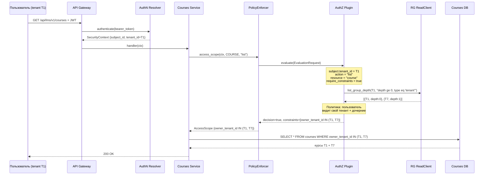

# AuthZ + RG Integration — Questions

## 1. RG Access API — отдельный crate или trait в существующем SDK?

Сейчас в DESIGN есть `ResourceGroupReadClient` (list_group_depth, list_memberships). RG Access API — это он и есть, или нужен отдельный trait/crate с другим контрактом (например, без `SecurityContext`, раз клиент — только AuthZ через MTLS)?

> RG Access API - "private REST+GRPC+SDK" и "MTLS" имеет доступ ко всем данным RG в рамках одного запрашиваемого тенанта,
> самый частый и возможно, единственный запрос к RG Access API - верни мне доступню иерархию тенантов по tenant_id
> по факту это очень похоже  `ResourceGroupReadClient` (list_group_depth) без list_memberships
> предлагаю объявить новый ResourceGroupReadHierarchy в котором

## 2. RG Access API — transport?

Написано "private REST+GRPC+SDK" и "MTLS". Сейчас authz-resolver работает in-process через ClientHub. RG Access API будет:
- a) in-process trait в ClientHub (как сейчас) + опционально GRPC для out-of-process deployment?
- b) всегда через GRPC/REST с MTLS (отдельный сервис)?

## 3. Циклическая зависимость при init — порядок загрузки?

AuthZ зависит от RG Access API SDK, RG Management API зависит от AuthZ SDK. При старте:
- RG Module инициализируется первым (регистрирует `ResourceGroupReadClient`)?
- Потом AuthZ (находит RG Read, регистрирует `AuthZResolverClient`)?
- Потом RG Management API начинает принимать запросы (находит AuthZ)?

Или RG Management и RG Access — это один модуль с двумя фазами init?

### Ответ

Циклическая зависимость решается через **фазовую инициализацию** и **lazy discovery**.

#### Проблема

```
RG Management API ──depends on──► AuthZ SDK (для проверки прав на write)
AuthZ Plugin       ──depends on──► RG Read SDK (для чтения иерархии тенантов)
```

Если оба ждут друг друга при старте — deadlock.

#### Решение: phased init

```text
┌─────────────────────────────────────────────────────────────────────┐
│ Phase 1: SystemCapability init (модули регистрируют клиенты)       │
│                                                                     │
│  1. RG Module.init()                                                │
│     └─► ClientHub.register(ResourceGroupReadClient)                 │
│     └─► ClientHub.register(ResourceGroupClient)                     │
│     └─► REST/gRPC endpoints ещё НЕ принимают трафик                 │
│                                                                     │
│  2. AuthZ Resolver.init()                                           │
│     └─► ClientHub.register(AuthZResolverClient)                     │
│     └─► Plugin discovery — lazy (будет при первом evaluate())       │
│                                                                     │
├─────────────────────────────────────────────────────────────────────┤
│ Phase 2: Ready (модули начинают принимать трафик)                   │
│                                                                     │
│  3. RG Module начинает принимать REST/gRPC запросы                  │
│     └─► write-операции вызывают PolicyEnforcer → AuthZResolverClient│
│         (доступен с шага 2)                                         │
│     └─► seed-операции используют system SecurityContext             │
│         (обходят AuthZ, deadlock невозможен)                        │
│                                                                     │
│  4. AuthZ plugin при первом evaluate()                              │
│     └─► lazy-discover RG через types-registry                      │
│     └─► вызывает ResourceGroupReadClient (доступен с шага 1)       │
└─────────────────────────────────────────────────────────────────────┘
```

#### Почему нет deadlock

| Момент | RG | AuthZ |
|--------|----|-------|
| Phase 1, шаг 1 | Регистрирует read-клиенты в ClientHub | Ещё не стартовал |
| Phase 1, шаг 2 | Клиенты в ClientHub готовы | Регистрирует AuthZResolverClient, plugin discovery отложен |
| Phase 2, шаг 3 | Начинает принимать трафик, может звать AuthZ | Клиент в ClientHub готов |
| Phase 2, шаг 4 | — | Первый evaluate() → lazy-discover → находит RG read (с шага 1) |

Seed-операции (создание начальных типов и root-группы) выполняются с **system-level `SecurityContext`** и обходят AuthZ — поэтому seed не зависит от готовности AuthZ.

#### Сквозной пример: пользователь тенанта T1 открывает список курсов

Иерархия тенантов:

```text
tenant T1 (11111111-1111-1111-1111-111111111111)
└── tenant T7 (77777777-7777-7777-7777-777777777777)
tenant T9 (99999999-9999-9999-9999-999999999999)
```

Пользователь тенанта `T1` отправляет запрос `GET /api/lms/v1/courses`. По иерархии ему доступны курсы `T1` и дочернего `T7`. Тенант `T9` — чужой, его курсы не видны.



**Шаг за шагом:**

**1. Аутентификация (API Gateway → AuthN Resolver)**

Пользователь отправляет запрос с JWT-токеном. API Gateway извлекает bearer token и вызывает `AuthNResolverClient.authenticate()`. AuthN-плагин валидирует токен (подпись, срок действия) и возвращает `SecurityContext`:

```rust
SecurityContext {
    subject_id: Uuid("user-123"),
    subject_tenant_id: Uuid("11111111-..."),  // T1
    token_scopes: ["*"],
    bearer_token: Some(SecretString("eyJ...")),
}
```

Gateway вставляет `SecurityContext` в request extensions. Courses handler получает его через `Extension<SecurityContext>`.

**2. Courses Service → PolicyEnforcer**

Courses handler перед запросом в БД вызывает `PolicyEnforcer`:

```rust
let enforcer = PolicyEnforcer::new(authz_client);
let scope = enforcer.access_scope(
    &ctx,                    // SecurityContext из JWT
    &COURSE_RESOURCE,        // ResourceType { name: "gts.x.lms.course.v1~", supported_properties: ["owner_tenant_id"] }
    "list",                  // action
    None,                    // resource_id (нет, это list)
).await?;
```

`PolicyEnforcer` собирает `EvaluationRequest`:

```rust
EvaluationRequest {
    subject: Subject { id: user_123, properties: {"tenant_id": "T1"} },
    action: Action { name: "list" },
    resource: Resource { resource_type: "gts.x.lms.course.v1~", id: None, properties: {} },
    context: EvaluationRequestContext {
        require_constraints: true,
        supported_properties: ["owner_tenant_id"],
        tenant_context: Some(TenantContext { root_id: T1, mode: Subtree }),
        bearer_token: Some("eyJ..."),
        ..
    },
}
```

**3. AuthZ Plugin → RG Read (иерархия тенантов)**

AuthZ plugin получает `EvaluationRequest` и определяет, какие тенанты доступны пользователю. Для этого вызывает RG:

```rust
let hierarchy = rg_read.list_group_depth(
    &system_ctx,                              // system SecurityContext (AuthZ — доверенный сервис)
    Uuid::parse_str("11111111-...")?,          // T1 — домашний тенант пользователя
    ListQuery::new().filter("depth ge 0 and group_type eq 'tenant'"),
).await?;
```

RG возвращает тенант-поддерево:

```json
{
  "items": [
    {"group_id": "11111111-...", "group_type": "tenant", "name": "T1", "depth": 0},
    {"group_id": "77777777-...", "group_type": "tenant", "name": "T7", "depth": 1}
  ],
  "page_info": {"top": 50, "skip": 0}
}
```

Тенант `T9` не возвращается — он не в поддереве `T1`.

**4. AuthZ Plugin → constraints**

Плагин применяет свою политику к иерархии и формирует constraints:

```rust
EvaluationResponse {
    decision: true,
    context: EvaluationResponseContext {
        constraints: vec![
            Constraint {
                predicates: vec![
                    Predicate::In(InPredicate {
                        property: "owner_tenant_id",
                        values: [T1, T7],
                    })
                ]
            }
        ],
    },
}
```

**5. PolicyEnforcer → AccessScope**

`compile_to_access_scope()` преобразует constraints в `AccessScope`:

```
AccessScope {
    constraints: [
        ScopeConstraint {
            filters: [
                ScopeFilter::In { property: "owner_tenant_id", values: [Uuid(T1), Uuid(T7)] }
            ]
        }
    ]
}
```

**6. Courses Service → SQL**

SecureORM применяет `AccessScope` к запросу:

```sql
SELECT * FROM courses
WHERE owner_tenant_id IN ('11111111-...', '77777777-...')
ORDER BY id ASC
LIMIT 50 OFFSET 0;
```

Пользователь видит курсы `T1` и `T7`. Курсы `T9` отфильтрованы на уровне SQL.

#### Разделение ответственности

```text
┌──────────────────────┐     ┌──────────────────────┐     ┌──────────────────────┐
│   Courses Service    │     │    AuthZ Plugin       │     │   Resource Group     │
│                      │     │                       │     │                      │
│ Знает:               │     │ Знает:                │     │ Знает:               │
│ • схему курсов       │     │ • политики доступа    │     │ • иерархию групп     │
│ • SQL для курсов     │     │ • как строить         │     │ • членство ресурсов  │
│ • OData фильтры      │     │   constraints         │     │ • closure table      │
│                      │     │                       │     │                      │
│ НЕ знает:            │     │ НЕ знает:             │     │ НЕ знает:            │
│ • иерархию тенантов  │     │ • что такое курсы     │     │ • что такое курсы    │
│ • политики доступа   │     │ • SQL-схему курсов    │     │ • политики доступа   │
│ • как работает RG    │     │ • как хранятся курсы  │     │ • SQL-схему курсов   │
└──────────────────────┘     └──────────────────────┘     └──────────────────────┘
         │                            │                            │
         │ access_scope()             │ evaluate()                 │ list_group_depth()
         ▼                            ▼                            ▼
   SQL predicates              constraints                  graph data only
```

Каждый компонент отвечает только за свою область. Courses не знает про иерархию тенантов. AuthZ не знает про курсы. RG не знает ни про курсы, ни про политики — только отдаёт данные иерархии.

## 4. AuthZ на read-операции RG — нужен?

RG Management API зависит от AuthZ для write-операций. А read-операции (listGroups, getGroup, listGroupDepth)?
- a) read тоже через AuthZ (access_evaluation_request → constraints → SecureORM)?
- b) read без AuthZ, только tenant scoping из SecurityContext?

## 5. RG Plugin — что именно он делает?

Написано "RG Plugin (полноценный сервис с базой данных, апи, сидинг)". В authz-resolver паттерн plugin = vendor-specific PDP. В RG контексте plugin — это:
- a) reference implementation бизнес-логики RG (как static-authz-plugin для AuthZ)?
- b) vendor-replaceable storage backend (вендор приносит свою БД/хранилище иерархий)?
- c) и то и другое?

## 6. "Возможен сценарий работы AuthZ без RG" — как именно?

Сейчас static-authz-plugin возвращает `owner_tenant_id` constraint без обращения к RG. Это и есть "AuthZ без RG"? Или имеется в виду что AuthZ plugin может использовать другой источник иерархий (не RG), и `Capability::GroupMembership` / `Capability::GroupHierarchy` просто не заявляются?

## 7. RG Management API — AuthZ granularity?

Какие action/resource передаются в `access_evaluation_request` при write-операциях RG?
- Один resource type на весь RG (`resource_group`) или раздельно (`resource_group_type`, `resource_group_entity`, `resource_group_membership`)?
- Actions: CRUD (`create`, `update`, `delete`) или domain-specific (`move_subtree`, `change_type`)?

## 8. Tenant context в RG Access API для AuthZ?

AuthZ plugin вызывает `list_group_depth(ctx, group_id, query)`. Какой `SecurityContext` передаётся?
- a) service-level identity AuthZ-модуля (MTLS cert → system principal)?
- b) оригинальный SecurityContext конечного пользователя (passthrough)?

Это важно для tenant scoping: если AuthZ вызывает RG от имени system principal, то RG Access API не должен фильтровать по tenant.

## 9. Seed data — кто создаёт начальные типы и root groups?

RG Plugin описан как "полноценный сервис с сидингом". Seed включает:
- a) только resource_group_type (tenant, department, branch)?
- b) type + root tenant group (первый tenant)?
- c) конфигурируется per-deployment?

И связанный вопрос: seed выполняется до или после AuthZ init? (Если RG write зависит от AuthZ, а AuthZ ещё не ready при seed — deadlock.)

## 10. Vendor RG Plugin — контракт замены?

Написано "возможен Vendor RG Plugin + Vendor RG Service". Вендор заменяет:
- a) только storage (свой persistence adapter за тем же trait)?
- b) весь domain layer (своя валидация типов, closure logic)?
- c) полностью свой сервис, который просто реализует `ResourceGroupReadClient` + `ResourceGroupClient`?

И если вендор приносит свой RG — AuthZ plugin по-прежнему обращается к `ResourceGroupReadClient` через ClientHub, просто за ним стоит другая реализация?
